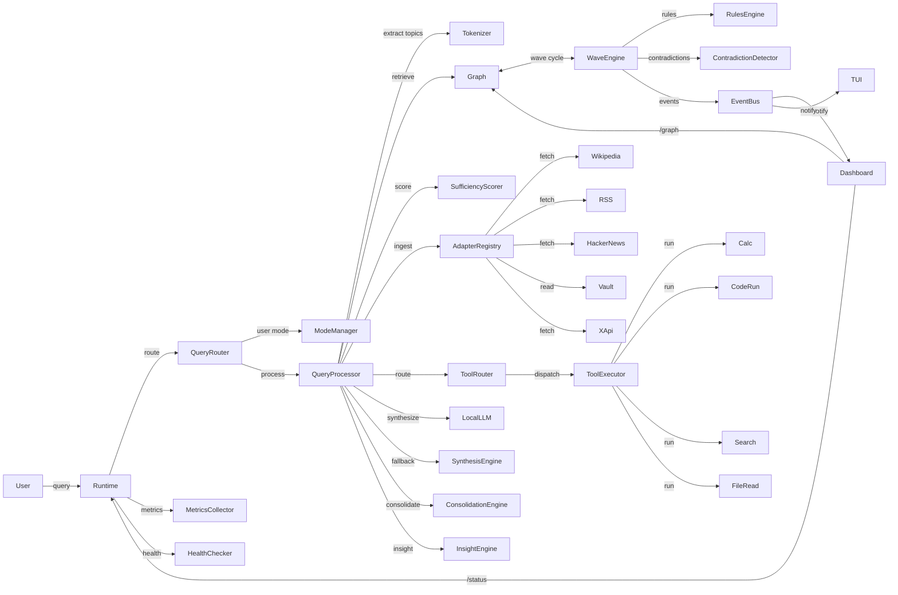
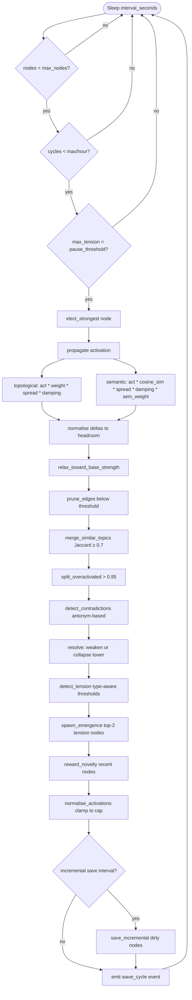
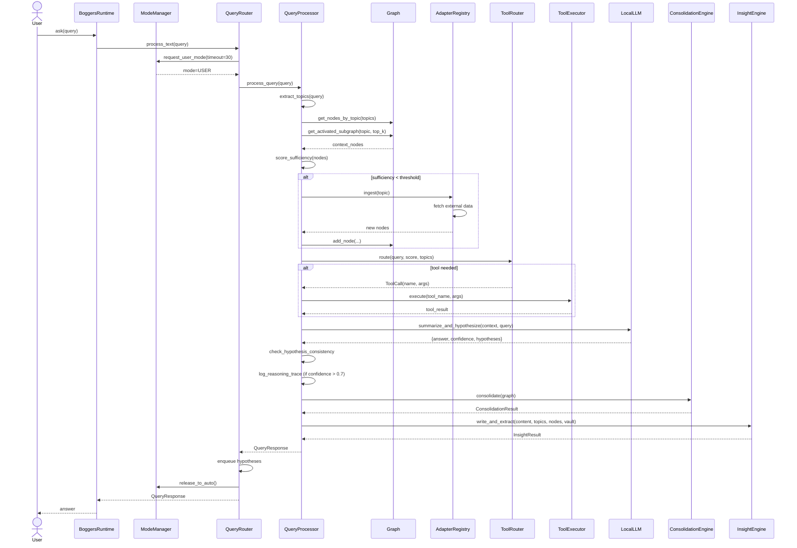
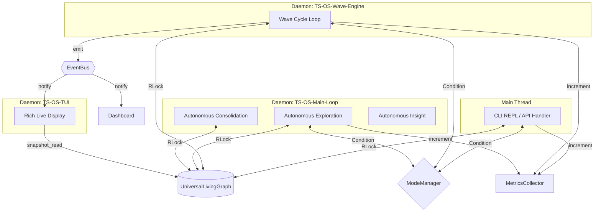
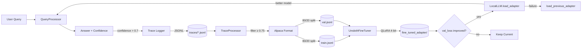
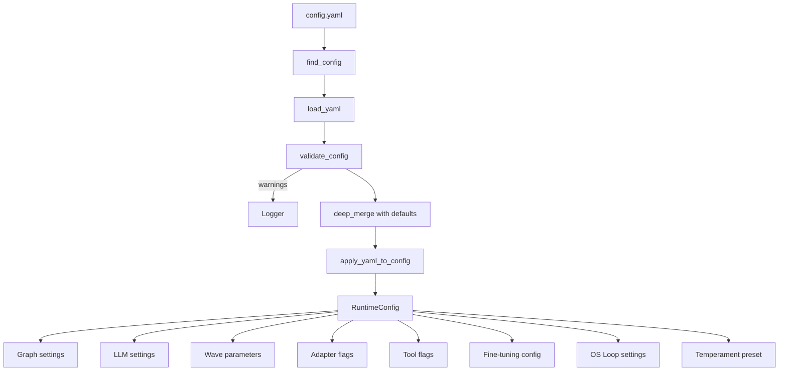

# BoggersTheAI — TS Engine Architecture (Current Focus)

> **Version**: TS Engine foundation (2026-06, post Wave 0 / early self-data)
> **Canonical source**: `BoggersTheAI/ARCHITECTURE.md`
> **Focus**: Verifiable reasoning engine (graph + waves + verifier + BOGVM) + TensionLM synthesis from verified state. Not full traditional LLM.

See README.md and experiments/frontier/SERIOUS_GPT55_ROADMAP.md for status. Current: light factual paths, full formal pipeline producing BOGVM traces, self-data generation + injection, proof prompts, math boosts. Graph ~35 nodes. Factual fast (2 waves, 0 BOGVM). Formal generates real self-data. Loop closing.

---

## Table of Contents

1. [System Overview](#system-overview)
2. [Module Layout](#module-layout)
3. [core/graph/ — The Living Graph](#coregraph--the-living-graph)
4. [core/ — Engine Services](#core--engine-services)
5. [adapters/ — Data Ingestion](#adapters--data-ingestion)
6. [tools/ — External Tool Execution](#tools--external-tool-execution)
7. [entities/ — Domain Services](#entities--domain-services)
8. [multimodal/ — Voice + Image I/O](#multimodal--voice--image-io)
9. [interface/ — User Interfaces](#interface--user-interfaces)
10. [mind/ — Terminal UI](#mind--terminal-ui)
11. [dashboard/ — Web Dashboard](#dashboard--web-dashboard)
12. [Thread Safety Model](#thread-safety-model)
13. [Configuration System](#configuration-system)
14. [Persistence Model](#persistence-model)
15. [Self-Improvement Pipeline](#self-improvement-pipeline)
16. [Diagrams](#diagrams)

---

## System Overview

BoggersTheAI is a **graph-native cognitive engine** that implements the TS-OS (Thinking System Operating System) loop. All knowledge lives in a living graph of interconnected nodes. A continuous background wave cycle propagates activation, relaxes tension, prunes weak connections, detects contradictions, and spawns emergent nodes — all autonomously.

User queries flow through a pipeline that retrieves context from the graph, optionally ingests external data via adapters, routes to tools when needed, synthesizes answers via local LLM or extractive fallback, and feeds high-confidence reasoning traces back into a self-improvement pipeline.

The system runs entirely local-first with no mandatory cloud dependencies. Inference defaults to Ollama; fine-tuning uses Unsloth/QLoRA; embeddings use `nomic-embed-text`; voice uses faster-whisper and piper-tts; image captioning uses BLIP2.

---

## Module Layout

```
BoggersTheAI/
├── core/                        # Core TS-OS engine
│   ├── graph/                   # Graph data structure + algorithms
│   │   ├── universal_living_graph.py   # Main graph class (thread-safe, dual backend)
│   │   ├── wave_runner.py              # WaveCycleRunner — wave thread + cycle step order
│   │   ├── wave_propagation.py         # Low-level propagate / relax / normalise
│   │   ├── rules_engine.py             # Prune / merge / split / emerge / reward
│   │   ├── node.py                     # GraphNode internal dataclass
│   │   ├── sqlite_backend.py           # SQLite WAL persistence
│   │   ├── snapshots.py                # Timestamped full-graph snapshots
│   │   ├── export.py                   # GraphML + JSON-LD export
│   │   ├── pruning.py                  # Configurable pruning policies
│   │   ├── operations.py               # Pure BFS / batch / components / range helpers
│   │   └── migrate.py                  # Forward-compatible schema migration
│   ├── path_sandbox.py          # validate_path — paths confined to base directory
│   ├── query_processor.py      # Query pipeline orchestrator
│   ├── router.py               # Mode-aware query routing + hypothesis queue
│   ├── wave.py                 # Simplified wave API (propagate/relax/break/evolve)
│   ├── types.py                # Node, Edge, Tension dataclasses
│   ├── local_llm.py            # Ollama / Unsloth LLM wrapper
│   ├── fine_tuner.py           # QLoRA fine-tuning pipeline
│   ├── trace_processor.py      # Reasoning trace → training data converter
│   ├── embeddings.py           # Cosine similarity + OllamaEmbedder
│   ├── contradiction.py        # Antonym-based topic-indexed conflict detection
│   ├── temperament.py          # Cognitive temperament presets
│   ├── context_mind.py         # Multi-context subgraph views
│   ├── protocols.py            # Shared Protocol definitions (cross-module)
│   ├── config_loader.py        # YAML config loading + deep merge
│   ├── config_resolver.py      # Nested config key resolution
│   ├── config_schema.py        # Config validation (ranges, required sections)
│   ├── mode_manager.py         # AUTO/USER mode coordination
│   ├── events.py               # In-process event bus (singleton)
│   ├── plugins.py              # Entry-point plugin discovery
│   ├── health.py               # Named health check registry
│   ├── metrics.py              # Thread-safe counters / gauges / timers
│   └── logger.py               # Structured logging namespace
├── adapters/                   # External data ingestion
│   ├── base.py                 # AdapterRegistry + caching + rate limiting + cache lock
│   ├── http_client.py          # fetch_url / fetch_json + retries + backoff
│   ├── wikipedia.py            # Wikipedia MediaWiki API
│   ├── rss.py                  # RSS/Atom feeds (HTTPS-only)
│   ├── hacker_news.py          # Hacker News Algolia API
│   ├── markdown.py             # Local markdown file ingestion
│   ├── vault.py                # Knowledge vault (delegates to markdown)
│   └── x_api.py                # X (Twitter) API v2
├── tools/                      # External tool execution
│   ├── base.py                 # ToolRegistry + ToolProtocol
│   ├── executor.py             # Tool dispatch + timeout + metrics
│   ├── router.py               # Rule-based query → tool routing
│   ├── calc.py                 # Safe arithmetic (AST-based)
│   ├── code_run.py             # Sandboxed Python execution
│   ├── search.py               # HN Algolia search
│   ├── file_read.py            # Path-restricted file reading + max bytes
│   ├── web_search.py           # DuckDuckGo instant answers
│   ├── datetime_tool.py        # UTC now / parse / format
│   └── unit_convert.py         # Common unit conversions
├── entities/                   # Domain services
│   ├── consolidation.py        # Jaccard-based node merging
│   ├── insight.py              # Markdown insight generation + hypothesis extraction
│   ├── inference_router.py     # Throttled inference with fallback
│   └── synthesis_engine.py     # Extractive synthesis
├── multimodal/                 # Voice + image I/O
│   ├── base.py                 # Protocol re-exports
│   ├── voice_in.py             # faster-whisper transcription
│   ├── voice_out.py            # piper-tts synthesis
│   ├── image_in.py             # BLIP2 image captioning
│   ├── whisper.py              # Whisper backend alias
│   └── clip_embed.py           # CLIP backend alias
├── interface/                  # User-facing entry points
│   ├── runtime.py              # BoggersRuntime — composition root (+ mixins)
│   ├── autonomous_loop.py      # AutonomousLoopMixin — OS loop, nightly, exploration
│   ├── self_improvement.py     # SelfImprovementMixin — traces, fine-tune, hot-swap
│   ├── chat.py                 # CLI REPL interface
│   └── api.py                  # HTTP API handler
├── mind/                       # Terminal UI
│   └── tui.py                  # Rich-based live TUI
├── dashboard/                  # Web dashboard
│   └── app.py                  # FastAPI; get_runtime() lazy init; /health/live|ready
├── tests/                      # pytest test suite
├── config.yaml                 # Central configuration
└── ARCHITECTURE.md             # This document
```

---

## core/graph/ — The Living Graph

The graph subsystem is the beating heart of BoggersTheAI. Every piece of knowledge — ingested, inferred, or emergent — exists as a node in the living graph. Edges represent semantic or structural relationships between nodes. A continuous wave cycle propagates activation, detects tension, resolves contradictions, and spawns new knowledge.

### universal_living_graph.py — `UniversalLivingGraph`

The central graph class. All other modules interact with the graph through this interface.

#### Data Structures

| Structure | Type | Purpose |
|-----------|------|---------|
| `nodes` | `Dict[str, Node]` | All graph nodes keyed by ID |
| `edges` | `List[Edge]` | All directed edges |
| `_adjacency` | `Dict[str, Dict[str, float]]` | Precomputed neighbor → weight mapping for O(1) traversal |
| `_topic_index` | `Dict[str, Set[str]]` | Inverted index: topic → set of node IDs for O(1) topic lookups |
| `_dirty_nodes` | `Set[str]` | Nodes modified since last save (for incremental persistence) |
| `_strongest_cache` | `Node \| None` | Cached strongest-node result with invalidation |

#### Thread Safety

- **`threading.RLock`** (`_lock`) guards all mutations to nodes, edges, adjacency, and topic index. Reentrant to allow nested graph operations within a single thread.
- **`threading.Event`** (`_wave_stop_event`) signals the background wave thread to stop cleanly.
- **`snapshot_read()`** returns a deep copy of all nodes and edges, safe to iterate outside the lock.

#### Dual Persistence Backend

| Backend | Trigger | Implementation |
|---------|---------|----------------|
| **SQLite** (default) | `config.runtime.graph_backend == "sqlite"` | `SQLiteGraphBackend` with WAL mode |
| **JSON** | fallback / simple deployments | Direct JSON serialization to `graph.json` |

On startup, if SQLite is configured and `graph.db` exists, the graph loads from SQLite. Otherwise, it falls back to JSON. The backend is stored in `_sqlite_backend`.

#### Node Creation (`add_node`)

```
add_node(node_id, content, topics, activation, stability, base_strength, last_wave, attributes, embedding)
```

1. Creates a `Node` dataclass instance
2. If an `OllamaEmbedder` is set and `embedding` is None, auto-embeds the content via `embedder.embed(content)`
3. Inserts into `self.nodes[node_id]`
4. Updates `_topic_index`: for each topic, adds `node_id` to `_topic_index[topic]`
5. Marks `node_id` in `_dirty_nodes` for incremental save
6. Invalidates `_strongest_cache`
7. Returns the `Node`

#### Edge Creation (`add_edge`)

Creates an `Edge(src, dst, weight, relation)`, appends to `self.edges`, and updates `_adjacency[src][dst] = weight` and `_adjacency[dst][src] = weight` (bidirectional).

#### Querying

| Method | Returns | Notes |
|--------|---------|-------|
| `get_node(node_id)` | `Node \| None` | Direct dict lookup |
| `get_neighbors(node_id)` | `Dict[str, float]` | From `_adjacency`, O(1) |
| `get_nodes_by_topic(topic)` | `List[Node]` | From `_topic_index`, O(1) lookup + node resolution |
| `get_activated_subgraph(query_topic, top_k=5)` | `list[dict]` | Topic index → sort by activation → top-k → dict representations |
| `get_conversation_history(last_n=8)` | `list[dict]` | Recent conversation-type nodes |
| `strongest_node()` | `Node \| None` | Cached; recalculated on invalidation |

#### Wave Cycle (`run_wave_cycle`)

Executes one full TS-OS cycle under the lock:

1. **`elect_strongest()`** — finds node with max `activation * base_strength` (ties broken by `stability`)
2. **`propagate()`** — hybrid topological + semantic activation spread (see `wave_propagation.py`)
3. **`relax()`** — exponential decay of all activations toward `base_strength`
4. **`prune(threshold)`** — remove edges below weight threshold
5. **`detect_tensions()`** — find high-tension nodes
6. **Spawn emergence** — via `rules_engine.run_rules_cycle()`
7. **Detect + resolve contradictions** — via `contradiction.py`
8. **Normalise activations** — clamp to `activation_cap`
9. **Incremental save** (if interval reached)
10. **Emit `wave_cycle` event** via `EventBus`

Returns a `RulesEngineCycleResult` with `strongest_node_id`, `tensions`, `pruned_edges`, `emergent_nodes`, `contradictions_found`, `contradictions_resolved`.

#### Background Wave Thread

```python
start_background_wave() → threading.Thread  # daemon=True, name="TS-OS-Wave-Engine"
stop_background_wave()                      # sets _wave_stop_event
```

The daemon thread loops:
1. Sleep for `wave.interval_seconds` (default 30s)
2. Check guardrails:
   - **Max nodes**: skip cycle if `len(nodes) >= _MAX_NODES_SAFETY` (10,000)
   - **Max cycles/hour**: skip if exceeded `_MAX_CYCLES_PER_HOUR` (200)
   - **High tension pause**: skip if max tension > `_HIGH_TENSION_PAUSE_THRESHOLD` (0.95)
3. Execute `run_wave_cycle()`
4. Repeat until `_wave_stop_event` is set

#### Persistence Methods

| Method | Behavior |
|--------|----------|
| `save(path)` | Full save to JSON or SQLite (all nodes + edges) |
| `save_incremental()` | Persist only dirty nodes; returns count saved |
| `load(path)` | Load from JSON or SQLite; rebuilds adjacency + topic index |
| `save_graph_snapshot(label)` | Delegates to `GraphSnapshotManager`; timestamped full dump |
| `restore_graph_snapshot(filename)` | Wipes current graph, restores from snapshot |

#### Export

| Method | Format |
|--------|--------|
| `export_graphml(path)` | GraphML XML with all node/edge attributes |
| `export_json_ld(path)` | JSON-LD with `@context` using schema.org concepts |

#### Metrics (`get_metrics`)

Returns dict with: `node_count`, `edge_count`, `active_nodes` (activation > 0), `avg_activation`, `avg_stability`, `max_activation`, `topic_count`.

---

### wave_propagation.py — Low-Level Wave Functions

Pure functions operating on `Dict[str, GraphNode]` and adjacency structures. No class — all module-level functions.

#### `elect_strongest(nodes) → GraphNode | None`

Scoring: `activation * base_strength`, ties broken by `stability`. Skips collapsed nodes.

#### `propagate(nodes, adjacency, spread_factor, damping, activation_cap, semantic_weight)`

Two-signal propagation for every active node (activation > 0):

1. **Topological signal** — for each neighbor in adjacency:
   ```
   delta = source.activation * edge_weight * spread_factor * damping
   ```
2. **Semantic signal** — if both nodes have embeddings:
   ```
   sim = cosine_similarity(source.embedding, neighbor.embedding)
   delta += source.activation * sim * spread_factor * damping * semantic_weight
   ```
3. All deltas are accumulated per target node, then normalized via `_normalise_updates` to respect `activation_cap` (headroom = cap - current activation).

#### `relax_toward_base_strength(nodes, decay, activation_cap)`

For each non-collapsed node:
```
node.activation += (node.base_strength - node.activation) * (1 - decay)
```
Then clamped to `[0, activation_cap]`.

#### `normalise_activations(nodes, cap) → int`

Hard clamp: `node.activation = min(node.activation, cap)`. Returns count of clamped nodes.

#### Constants

| Name | Default | Purpose |
|------|---------|---------|
| `GLOBAL_ACTIVATION_CAP` | `1.0` | System-wide maximum activation |

---

### rules_engine.py — Graph Evolution Rules

Orchestrates all graph-level mutation rules: pruning, tension detection, emergence, merging, splitting, novelty reward, and contradiction handling.

#### `RulesEngineCycleResult` (dataclass)

| Field | Type | Description |
|-------|------|-------------|
| `strongest_node_id` | `str \| None` | ID of elected strongest node |
| `tensions` | `Dict[str, float]` | Node ID → tension score |
| `pruned_edges` | `int` | Count of edges removed |
| `emergent_nodes` | `List[str]` | IDs of newly spawned nodes |
| `contradictions_found` | `int` | Contradictions detected |
| `contradictions_resolved` | `int` | Contradictions resolved |

#### Named Constants

| Constant | Value | Purpose |
|----------|-------|---------|
| `PRUNE_EDGE_THRESHOLD` | 0.25 | Minimum edge weight to survive |
| `EMERGENCE_MAX_SPAWN` | 2 | Max emergent nodes per cycle |
| `EMERGENCE_BASE_ACTIVATION` | 0.3 | Starting activation for emergent nodes |
| `EMERGENCE_TENSION_MULTIPLIER` | 0.2 | Tension contribution to activation |
| `EMERGENCE_BASE_STABILITY` | 0.7 | Starting stability for emergent nodes |
| `EMERGENCE_BASE_STRENGTH` | 0.6 | Starting base strength for emergent nodes |
| `MERGE_SIMILARITY_THRESHOLD` | 0.7 | Jaccard overlap threshold for merging |
| `SPLIT_ACTIVATION_CAP` | 0.95 | Activation level triggering split |
| `SPLIT_ACTIVATION_FACTOR` | 0.5 | Factor applied to halve split node activation |
| `SPLIT_STABILITY_FACTOR` | 0.9 | Stability scaling for split sibling |
| `NOVELTY_BOOST` | 0.05 | Activation boost for recent nodes |
| `NOVELTY_RECENCY_WINDOW` | 10 | Wave window for "recent" |

#### Functions

**`prune_edges(adjacency, threshold) → int`**
Iterates all adjacency entries; removes edges with `weight < threshold`. Returns count removed.

**`detect_tension(nodes, type_thresholds) → Dict[str, float]`**
Type-aware stability thresholds:
- `conversation`: 0.3
- `insight`: 0.4
- `emergent`: 0.5
- default: 0.5

Tension score = `1.0 - node.stability` for nodes below their type's threshold.

**`spawn_emergence(nodes, tensions, edges, evolve_fn) → List[str]`**
Takes top-2 tension nodes, spawns `emergent:{node_id}` with:
- Content from `evolve_fn(parent_content, neighbor_contents, topics)` if provided, else placeholder
- Activation = `EMERGENCE_BASE_ACTIVATION + tension * EMERGENCE_TENSION_MULTIPLIER`
- Connected to parent and parent's neighbors

**`merge_similar_topics(nodes, edges, similarity_threshold) → List[str]`**
Compares all non-collapsed node pairs by Jaccard similarity of topic sets. If overlap ≥ threshold, merges into the higher-stability node. Returns list of merged (removed) node IDs.

**`split_overactivated(nodes, edges, activation_cap) → List[str]`**
Nodes with `activation > activation_cap` get:
- Activation halved (`* SPLIT_ACTIVATION_FACTOR`)
- A `split:{node_id}` sibling created with half activation and `stability * SPLIT_STABILITY_FACTOR`
- Sibling connected to all original neighbors

**`reward_novelty(nodes, novelty_boost, recency_window, current_wave) → int`**
Boosts `activation` by `novelty_boost` for nodes where `current_wave - last_wave < recency_window`.

**`run_rules_cycle(nodes, adjacency, edges, damping, activation_cap, semantic_weight, evolve_fn) → RulesEngineCycleResult`**
Full orchestration:
1. `elect_strongest` → `propagate` → `relax_toward_base_strength`
2. `prune_edges`
3. `merge_similar_topics`
4. `split_overactivated`
5. `detect_contradictions` + `resolve_contradiction`
6. `detect_tension` → `spawn_emergence`
7. `reward_novelty`
8. `normalise_activations`
9. Return `RulesEngineCycleResult`

---

### node.py — `GraphNode`

Internal dataclass used by the rules engine. Mirrors `Node` from `types.py` but is the mutable working copy inside graph operations.

```python
@dataclass(slots=True)
class GraphNode:
    id: str
    content: str
    topics: List[str]
    activation: float = 0.0
    stability: float = 1.0
    base_strength: float = 0.5
    last_wave: int = 0
    collapsed: bool = False
    attributes: Dict[str, object] = field(default_factory=dict)
    embedding: List[float] = field(default_factory=list)
```

`slots=True` for memory efficiency — prevents `__dict__` creation per instance.

---

### sqlite_backend.py — `SQLiteGraphBackend`

Production persistence layer using SQLite with write-ahead logging.

#### Connection Management

- **Thread-local connections** via `threading.local()` — each thread gets its own `sqlite3.Connection` to avoid cross-thread locking issues.
- `check_same_thread=False` + thread-local pattern = safe concurrent reads from daemon threads.
- **WAL journal mode** (`PRAGMA journal_mode=WAL`): allows concurrent readers during writes.
- **NORMAL synchronous** (`PRAGMA synchronous=NORMAL`): trades a small durability risk for write performance.
- `row_factory = sqlite3.Row` for dict-like access.

#### Schema

```sql
CREATE TABLE IF NOT EXISTS nodes (
    id TEXT PRIMARY KEY,
    content TEXT,
    topics TEXT,           -- JSON array
    activation REAL,
    stability REAL,
    base_strength REAL,
    last_wave INTEGER,
    collapsed INTEGER,
    attributes TEXT,       -- JSON object
    embedding TEXT          -- JSON array (added by migration)
);

CREATE TABLE IF NOT EXISTS edges (
    src TEXT,
    dst TEXT,
    weight REAL,
    relation TEXT,
    PRIMARY KEY (src, dst)
);

CREATE TABLE IF NOT EXISTS meta (
    key TEXT PRIMARY KEY,
    value TEXT
);
```

Indexes on `nodes.activation`, `nodes.stability` for fast queries.

#### Methods

| Method | Description |
|--------|-------------|
| `save_node(node)` | `INSERT OR REPLACE` single node |
| `save_nodes_batch(nodes)` | `executemany` for bulk insert |
| `save_edge(edge)` | `INSERT OR REPLACE` single edge |
| `save_edges_batch(edges)` | `executemany` for bulk insert |
| `load_all_nodes()` | Returns `Dict[str, Node]` from full table scan |
| `load_all_edges()` | Returns `List[Edge]` from full table scan |
| `delete_node(node_id)` | Removes node + associated edges |
| `delete_edges_below(threshold)` | Removes all edges with `weight < threshold`; returns count |
| `node_count()` | `SELECT COUNT(*)` |
| `set_meta(key, value)` | Key-value metadata storage |
| `get_meta(key, default)` | Key-value metadata retrieval |
| `import_from_json(json_path)` | Loads a JSON graph file into SQLite; returns node count |
| `export_to_json(json_path)` | Dumps SQLite contents to JSON; returns `Path` |
| `close()` | Closes thread-local connection |

#### Migration

`_ensure_embedding_column(conn)` adds the `embedding TEXT` column if it doesn't exist (schema v1 → v2 compatibility).

---

### snapshots.py — `GraphSnapshotManager`

Full-graph point-in-time snapshots for versioning and rollback.

#### Configuration

| Constant | Value | Purpose |
|----------|-------|---------|
| `_DEFAULT_SNAPSHOT_DIR` | `"snapshots"` | Default directory |
| `_MAX_SNAPSHOTS` | `50` | FIFO pruning limit |

#### Snapshot Format

Filename: `snapshot-{ISO8601_timestamp}-{label_slug}.json`

Content: JSON object with `nodes` (list of node dicts) and `edges` (list of edge dicts).

#### Methods

| Method | Description |
|--------|-------------|
| `save_snapshot(nodes, edges, label)` | Serializes full graph state; enforces max 50 |
| `list_snapshots()` | Returns metadata list (filename, timestamp, label) |
| `load_snapshot(filename)` | Returns raw dict from JSON |
| `restore_snapshot(filename)` | Deserializes into `(Dict[str, Node], List[Edge])` |
| `delete_snapshot(filename)` | Removes a snapshot file |
| `_enforce_limit()` | Deletes oldest snapshots when count > 50 (FIFO) |

---

### export.py — Graph Export

Two export formats for interoperability:

#### `export_graphml(nodes, edges, path) → Path`

Standard GraphML XML via `xml.etree.ElementTree`:
- Each node becomes a `<node>` element with `<data>` children for: `content` (truncated to 500 chars), `topics`, `activation`, `stability`, `base_strength`
- Each edge becomes an `<edge>` element with `weight` and `relation` data
- Compatible with Gephi, yEd, NetworkX

#### `export_json_ld(nodes, edges, path) → Path`

JSON-LD with semantic context:
```json
{
  "@context": {
    "schema": "http://schema.org/",
    "boggers": "https://boggersthefish.com/schema/"
  },
  "@graph": [
    {"@type": "boggers:Concept", "@id": "node_id", ...},
    {"@type": "boggers:Relation", "boggers:source": "...", ...}
  ]
}
```

---

### pruning.py — `PruningPolicy`

Configurable policy-based node pruning for long-term graph health.

#### `PruningPolicy` (dataclass)

| Field | Default | Purpose |
|-------|---------|---------|
| `min_stability` | 0.1 | Nodes below this stability get collapsed |
| `max_age_waves` | 500 | Nodes not updated in this many waves get collapsed |
| `max_nodes` | 10,000 | Hard cap; excess nodes pruned by priority |
| `archive_collapsed` | `True` | Whether to mark as collapsed vs. delete |

#### `apply_pruning_policy(nodes, policy, current_wave) → list[str]`

Three-pass pruning:

1. **Stability pass**: collapse nodes with `stability < min_stability`
2. **Age pass**: collapse nodes where `current_wave - last_wave > max_age_waves`
3. **Cap pass**: if `len(nodes) > max_nodes`, sort remaining by `activation * stability` (tiebreak by `base_strength`), collapse lowest-priority nodes until under cap

Returns list of collapsed node IDs.

---

### migrate.py — Schema Migration

Forward-compatible migration for JSON graph files.

| Constant | Value |
|----------|-------|
| `CURRENT_SCHEMA_VERSION` | `2` |

#### Migration Path: v1 → v2

- Adds `base_strength` field (default 0.5) to all nodes
- Adds `attributes` field (default `{}`) to all nodes
- Adds `relation` field (default `"relates"`) to all edges
- Sets `schema_version: 2` in metadata

#### Functions

| Function | Description |
|----------|-------------|
| `get_schema_version(data)` | Reads `metadata.schema_version`, defaults to 1 |
| `migrate_v1_to_v2(data)` | Applies v1→v2 transformations |
| `migrate_graph_data(data)` | Runs all needed migrations sequentially |
| `migrate_json_file(path)` | Loads, migrates, and overwrites a JSON graph file in-place |

---

## core/ — Engine Services

### query_processor.py — `QueryProcessor`

The main query pipeline orchestrator. Takes a user query and produces a complete `QueryResponse`.

#### Protocol Dependencies

The QueryProcessor depends on six protocol interfaces, injected via the `QueryAdapters` dataclass:

| Protocol | Interface | Provider |
|----------|-----------|----------|
| `InferenceProtocol` | `synthesize(context, query)` | `InferenceRouter` or `BoggersSynthesisEngine` |
| `IngestProtocol` | `ingest(topic)` | `RegistryIngestAdapter` |
| `ToolProtocol` | `execute(tool_name, args)` | `ToolExecutor` |
| `ToolRouterProtocol` | `route(query, sufficiency_score, topics)` | `ToolRouter` |
| `ConsolidationProtocol` | `consolidate(graph, nodes)` | `ConsolidationEngine` |
| `InsightProtocol` | `write_insight(...)` / `extract_hypotheses(...)` | `InsightEngine` |
| `LocalLLMProtocol` | `summarize_and_hypothesize(context, query)` | `LocalLLM` |

#### `QueryResponse` (dataclass)

| Field | Type | Description |
|-------|------|-------------|
| `query` | `str` | Original query text |
| `topics` | `List[str]` | Extracted topics |
| `context` | `str` | Rendered context text |
| `sufficiency_score` | `float` | 0.0–1.0 context quality score |
| `used_research` | `bool` | Whether adapters were called |
| `used_tool` | `bool` | Whether a tool was executed |
| `tool_name` | `str \| None` | Which tool was used |
| `context_nodes` | `int` | Number of context nodes |
| `activation_scores` | `List[float]` | Activation values of context nodes |
| `consolidated_merges` | `int` | Nodes merged during consolidation |
| `insight_path` | `str \| None` | Path to generated insight file |
| `hypotheses` | `List[str]` | Generated follow-up hypotheses |
| `confidence` | `float` | 0.0–1.0 answer confidence |
| `reasoning_trace` | `str` | LLM reasoning chain |
| `answer` | `str` | Final synthesized answer |

#### Pipeline Stages

```
User Query
    │
    ▼
1. extract_topics(query)          ── regex tokenizer, stopword removal
    │
    ▼
2. retrieve_context(topics)       ── topic index lookup + activated subgraph, top-k
    │
    ▼
3. score_sufficiency(context)     ── weighted: count(0.4) + activation(0.4) + recency(0.2)
    │
    ▼
4. [if score < min_sufficiency]
   ingest(topics)                 ── call adapters for external data
    │
    ▼
5. route_tool(query, score, topics)
   [if tool needed]
   execute_tool(tool_name, args)  ── calc, code_run, search, file_read
    │
    ▼
6. synthesize(context, query)     ── LLM with retries OR extractive fallback
    │
    ▼
7. check_hypothesis_consistency   ── validates answer against context
    │
    ▼
8. log_reasoning_trace            ── writes to traces/*.jsonl if confidence > threshold
    │
    ▼
9. consolidate(graph)             ── merge similar nodes post-query
    │
    ▼
10. write_insight(...)            ── generate insight markdown + hypotheses
    │
    ▼
QueryResponse
```

#### Topic Extraction

Simple regex tokenizer: lowercases query, splits on non-alphanumeric, filters tokens < 3 chars and common stopwords. Returns `List[str]`.

#### Sufficiency Scoring

```python
score = (count_weight * min(node_count / top_k, 1.0)
       + activation_weight * avg_activation
       + recency_weight * recency_factor)
```

Weights: `count=0.4`, `activation=0.4`, `recency=0.2`. If score < `min_sufficiency` (configurable, default 0.3), triggers adapter ingestion.

#### Synthesis

1. **Primary**: `LocalLLM.summarize_and_hypothesize(context, query)` — returns structured JSON with `answer`, `confidence`, `reasoning_trace`, `hypotheses`
2. **Retry**: up to `max_retries` (default 2) on LLM failure
3. **Fallback**: `InferenceProtocol.synthesize(context, query)` — typically `BoggersSynthesisEngine` (extractive)

#### Trace Logging

When `confidence > min_confidence_for_log` (default 0.7), writes a JSONL entry to `traces/` with: query, answer, topics, confidence, reasoning_trace, timestamp.

---

### router.py — `QueryRouter`

Manages mode transitions, multimodal input, and autonomous exploration cycles.

#### `RouterConfig` (dataclass)

| Field | Default | Purpose |
|-------|---------|---------|
| `default_adapter` | `"wikipedia"` | Default adapter for topic ingestion |
| `adapter_sources` | `{}` | Adapter name → default source mapping |
| `max_hypotheses_per_cycle` | `2` | Max hypotheses to explore per autonomous cycle |

#### `RegistryIngestAdapter`

Bridges the `AdapterRegistry` to the `IngestProtocol` expected by `QueryProcessor`. On `ingest(topic)`:
1. Tries the default adapter with the topic as source
2. Creates graph nodes from returned adapter nodes

#### `QueryRouter`

**Threading**: `threading.Lock()` (`_queue_lock`) protects `_hypothesis_queue` (deque).

| Method | Description |
|--------|-------------|
| `process_text(query)` | Requests USER mode → delegates to `QueryProcessor` → enqueues hypotheses |
| `process_audio(audio, voice_in)` | Transcribes via `VoiceInProtocol` → routes as text |
| `process_image(image, image_in, query_hint)` | Captions via `ImageInProtocol` → routes as text |
| `run_autonomous_cycle()` | Runs wave cycle → takes strongest node → processes hypotheses in AUTO mode |

#### Autonomous Cycle

1. `ModeManager.begin_cycle()` — acquires AUTO mode
2. Run `wave.run_wave(graph)` — full TS-OS cycle
3. Get strongest node → build context query
4. Drain `_hypothesis_queue` up to `max_hypotheses_per_cycle`
5. Process each hypothesis as a query
6. `ModeManager.end_cycle()` — release
7. Return list of `QueryResponse` results

---

### wave.py — Simplified Wave API

Higher-level wave functions wrapping graph and rules engine internals.

#### `WaveResult` (dataclass)

| Field | Type |
|-------|------|
| `strongest_node` | `str \| None` |
| `tensions` | `Dict[str, float]` |
| `collapsed_node_id` | `str \| None` |
| `evolved_nodes` | `List[str]` |
| `contradictions_found` | `int` |

#### Functions

| Function | Description |
|----------|-------------|
| `propagate(graph, spread_factor, min_activation)` | Topological + semantic spread; returns activated nodes |
| `relax(graph, activated, high_activation, low_stability)` | Rules cycle + contradiction detection; returns tensions |
| `break_weakest(graph, tensions, tension_threshold)` | Collapses highest-tension node if above threshold; returns ID |
| `evolve(graph, collapsed_node_id)` | Spawns child node from collapsed parent via `evolve_fn`; returns new nodes |
| `run_wave(graph)` | Full TS-OS loop: propagate → relax → break → evolve; returns `WaveResult` |
| `get_wave_history()` | Returns last 100 wave results from `_wave_history` deque |

---

### types.py — Core Data Types

All dataclasses use `slots=True` for memory efficiency.

#### `Node`

```python
@dataclass(slots=True)
class Node:
    id: str
    content: str
    topics: List[str]
    activation: float = 0.0
    stability: float = 1.0
    base_strength: float = 0.5
    last_wave: int = 0
    collapsed: bool = False
    attributes: Dict[str, object] = field(default_factory=dict)
    embedding: List[float] = field(default_factory=list)
```

#### `Edge`

```python
@dataclass(slots=True)
class Edge:
    src: str
    dst: str
    weight: float = 1.0
    relation: str = "relates"
```

#### `Tension`

```python
@dataclass(slots=True)
class Tension:
    node_id: str
    score: float
    violations: List[str]
```

---

### local_llm.py — `LocalLLM`

Wraps Ollama for inference and Unsloth/PEFT for fine-tuned adapters.

#### Constructor

```python
LocalLLM(model="llama3.2", temperature=0.3, max_tokens=512, adapter_path=None, base_model=None)
```

If `adapter_path` is set, attempts to load a PEFT/Unsloth adapter. Falls back to Ollama if unavailable.

#### Methods

| Method | Description |
|--------|-------------|
| `summarize_and_hypothesize(context, query)` | Returns `{"answer", "confidence", "reasoning_trace", "hypotheses"}` |
| `synthesize_evolved_content(parent, neighbors, topics)` | Generates content for emergent nodes |
| `embed_text(text)` | Embeds via Ollama `nomic-embed-text` |
| `load_adapter(adapter_path, base_model, max_seq_length)` | Hot-loads a fine-tuned PEFT adapter |
| `load_previous_adapter()` | Rollback to previous adapter |
| `health_check()` | Returns `{"model", "status", "adapter_loaded"}` |

#### Generation Pipeline

1. If Unsloth adapter loaded → `model.generate()` with tokenizer
2. Else → HTTP POST to `http://localhost:11434/api/generate` (Ollama)
3. Parse response as JSON; fallback to raw text if parsing fails

---

### fine_tuner.py — `UnslothFineTuner`

QLoRA fine-tuning pipeline for self-improvement.

#### `FineTuningConfig` (dataclass)

| Field | Default | Description |
|-------|---------|-------------|
| `enabled` | `False` | Master switch |
| `base_model` | `"unsloth/llama-3.2-1b-instruct"` | Base model for fine-tuning |
| `max_seq_length` | `2048` | Context window |
| `learning_rate` | `2e-4` | AdamW learning rate |
| `epochs` | `1` | Training epochs |
| `adapter_save_path` | `"models/fine_tuned_adapter"` | Output directory |
| `auto_hotswap` | `True` | Auto-load adapter after training |
| `validation_enabled` | `True` | Run validation split |
| `max_memory_gb` | `12` | GPU memory limit |
| `safety_dry_run` | `True` | Skip actual training |
| `lora_r` | `16` | LoRA rank |
| `lora_alpha` | `16` | LoRA alpha |
| `lora_dropout` | `0` | LoRA dropout |
| `target_modules` | `["q_proj", "k_proj", ...]` | Modules to apply LoRA |
| `batch_size` | `2` | Training batch size |
| `gradient_accumulation_steps` | `4` | Gradient accumulation |
| `train_path` | `"dataset/train.jsonl"` | Training data path |
| `val_path` | `"dataset/val.jsonl"` | Validation data path |

#### `fine_tune(epochs) → dict`

1. Checks `enabled` and `not safety_dry_run`
2. Loads base model via `FastLanguageModel.from_pretrained()`
3. Applies PEFT LoRA with configured modules
4. Loads Alpaca JSONL dataset (instruction/input/output format)
5. Runs `SFTTrainer` for configured epochs
6. Evaluates on validation split if enabled
7. Saves adapter to `adapter_save_path`
8. Returns `{"success", "loss", "val_loss", "adapter_path"}`

---

### trace_processor.py — `TraceProcessor`

Converts reasoning traces into Alpaca-format training datasets.

#### `TraceProcessorConfig` (dataclass)

| Field | Default | Source |
|-------|---------|--------|
| `traces_dir` | `"traces"` | `inference.self_improvement.traces_dir` |
| `min_confidence` | `0.75` | `dataset_build.min_confidence` |
| `max_samples` | `5000` | `dataset_build.max_samples` |
| `output_dir` | `"dataset"` | `dataset_build.output_dir` |
| `split_ratio` | `0.8` | `dataset_build.split_ratio` |

#### `build_dataset(max_samples) → dict`

1. Scans `traces_dir` for `*.jsonl` files
2. Reads all traces, filters by `confidence >= min_confidence`
3. Converts each trace to Alpaca format:
   ```json
   {"instruction": "query text", "input": "context", "output": "answer"}
   ```
4. Shuffles and splits at `split_ratio` (default 80/20)
5. Writes `train.jsonl` and `val.jsonl` to `output_dir`
6. Returns `{"train_count", "val_count", "total", "train_path", "val_path"}`

---

### embeddings.py — Embedding Utilities

#### `cosine_similarity(a, b) → float`

```python
dot_product / (magnitude_a * magnitude_b)
```
Returns 0.0 if either vector has zero magnitude.

#### `OllamaEmbedder`

| Method | Description |
|--------|-------------|
| `__init__(model="nomic-embed-text")` | Configures Ollama embedding model |
| `is_available()` | Pings Ollama server |
| `embed(text) → List[float]` | Single text embedding |
| `embed_batch(texts) → List[List[float]]` | Batch embedding |

#### `batch_cosine_matrix(embeddings) → Dict[str, Dict[str, float]]`

Computes pairwise cosine similarity matrix for a dict of `{id: embedding_vector}`.

---

### contradiction.py — Conflict Detection

Topic-indexed contradiction detection using antonym dictionaries.

#### `Contradiction` (dataclass)

| Field | Type | Description |
|-------|------|-------------|
| `node_a` | `str` | First node ID |
| `node_b` | `str` | Second node ID |
| `reason` | `str` | Description of the conflict |
| `severity` | `float` | 0.0–1.0 severity score |

#### Antonym Dictionary (`_KNOWN_ANTONYMS`)

Predefined antonym pairs: `true/false`, `good/bad`, `increase/decrease`, `positive/negative`, `safe/dangerous`, etc.

#### `detect_contradictions(nodes, activation_threshold, topic_overlap_min) → List[Contradiction]`

1. Groups active nodes (activation > threshold) by topic
2. For each topic group, compares all node pairs
3. Checks content tokens against `_KNOWN_ANTONYMS`
4. If antonym pair found in different nodes' content → creates `Contradiction` with severity based on activation difference

#### `resolve_contradiction(nodes, contradiction, strategy)`

| Strategy | Behavior |
|----------|----------|
| `"weaken_lower"` | Reduces activation of the lower-stability node by 50% |
| `"collapse_lower"` | Sets `collapsed=True` on the lower-stability node |

---

### temperament.py — Cognitive Temperament Presets

Controls the "personality" of the wave engine by adjusting numerical parameters.

#### `Temperament` (dataclass)

| Field | Description |
|-------|-------------|
| `name` | Preset name |
| `spread_factor` | How far activation spreads (higher = more expansive thinking) |
| `relax_decay` | How fast activation decays (lower = faster relaxation) |
| `tension_threshold` | When tension triggers action |
| `prune_threshold` | Minimum edge weight to survive |
| `damping` | Signal attenuation during propagation |
| `activation_cap` | Maximum activation value |
| `description` | Human-readable description |

#### Presets

| Preset | spread | decay | tension | prune | damping | cap | Character |
|--------|--------|-------|---------|-------|---------|-----|-----------|
| `contemplative` | 0.05 | 0.90 | 0.15 | 0.20 | 0.97 | 0.8 | Slow, deep, preserving |
| `analytical` | 0.10 | 0.85 | 0.20 | 0.25 | 0.95 | 1.0 | Balanced, methodical |
| `reactive` | 0.20 | 0.75 | 0.30 | 0.30 | 0.90 | 1.0 | Fast, aggressive pruning |
| `critical` | 0.08 | 0.80 | 0.10 | 0.15 | 0.92 | 0.9 | Skeptical, high tension sensitivity |
| `creative` | 0.15 | 0.88 | 0.25 | 0.35 | 0.93 | 1.0 | Broad spread, tolerant of noise |
| `default` | 0.10 | 0.85 | 0.20 | 0.25 | 0.95 | 1.0 | Balanced (same as analytical) |

#### Functions

| Function | Description |
|----------|-------------|
| `get_temperament(name)` | Returns preset or `default` |
| `apply_temperament(wave_settings, temperament)` | Overlays temperament values onto wave settings dict |
| `list_temperaments()` | Returns list of preset names |

---

### context_mind.py — Multi-Context Subgraph Views

Allows creating named "minds" that filter the graph to relevant subsets.

#### `ContextMind` (dataclass)

| Field | Type | Description |
|-------|------|-------------|
| `name` | `str` | Context name (e.g., "security", "philosophy") |
| `node_filter` | `Callable` | Predicate: `(node_id) → bool` |
| `topic_filter` | `Set[str]` | Only include nodes with these topics |
| `temperament` | `str` | Which temperament preset to use |

**`includes_node(node_id, topics) → bool`**: Returns True if node passes the filter (node_filter and/or topic overlap).

#### `ContextManager`

Thread-safe (`threading.Lock`) management of named contexts.

| Method | Description |
|--------|-------------|
| `create(name, node_filter, topic_filter, temperament)` | Creates a new `ContextMind` |
| `get(name)` | Returns `ContextMind` or `None` |
| `get_or_default(name)` | Returns context or a default pass-all context |
| `delete(name)` | Removes a context |
| `list_contexts()` | Returns list of context names |
| `get_subgraph_view(context_name, nodes)` | Filters `nodes` dict through context's filter, returns subset |

---

### protocols.py — Shared Protocol Definitions

Breaks cross-module import cycles by defining Protocol interfaces in a single location.

| Protocol | Methods | Used By |
|----------|---------|---------|
| `VoiceInProtocol` | `transcribe(audio: bytes) → str` | `router.py`, `multimodal/` |
| `VoiceOutProtocol` | `synthesize(text: str) → bytes` | `runtime.py`, `multimodal/` |
| `ImageInProtocol` | `caption(image: bytes) → str` | `router.py`, `multimodal/` |
| `GraphProtocol` | `add_node(...)`, `add_edge(...)`, `get_nodes_by_topic(...)`, `get_activated_subgraph(...)` | `query_processor.py` |

---

### config_loader.py — Configuration Loading

#### Search Paths

`_SEARCH_PATHS = ("config.yaml", "BoggersTheAI/config.yaml")`

Looks for config.yaml in the current directory first, then in the BoggersTheAI subdirectory.

#### Functions

| Function | Description |
|----------|-------------|
| `find_config(search_paths)` | Returns first existing `Path` or `None` |
| `load_yaml(path)` | Reads YAML file, returns dict |
| `_deep_merge(base, overlay)` | Recursively merges overlay dict into base dict |
| `apply_yaml_to_config(config, yaml_data)` | Maps YAML sections to `RuntimeConfig` attributes |
| `load_and_apply(config, path)` | Full pipeline: find → load → validate → apply |

#### Merge Behavior

YAML values override defaults. Nested dicts are deep-merged (not replaced). This allows partial config overrides without losing defaults.

---

### config_resolver.py — Nested Config Access

#### `resolve_nested(config, *keys, default=None) → Any`

Safely walks a nested dict or object by key path. Returns `default` if any key is missing.

```python
resolve_nested(config, "inference", "ollama", "model", default="llama3.2")
```

Works with both dicts and objects (tries `getattr` fallback).

---

### config_schema.py — Config Validation

#### Validation Rules

**Range Checks** (`_RANGE_CHECKS`):
- `wave.damping`: 0.0–1.0
- `wave.activation_cap`: 0.1–10.0
- `wave.spread_factor`: 0.0–1.0
- `wave.relax_decay`: 0.0–1.0
- `guardrails.max_nodes`: 1–1,000,000
- `guardrails.max_cycles_per_hour`: 1–10,000
- `guardrails.high_tension_pause`: 0.0–1.0

**Required Sections** (`_REQUIRED_SECTIONS`): `["wave", "runtime"]`

#### `validate_config(raw) → List[str]`

Returns list of warning strings for missing sections or out-of-range values. Does not raise exceptions — warnings are logged.

---

### mode_manager.py — `ModeManager`

Coordinates AUTO and USER mode transitions to prevent interference between background wave cycles and user queries.

#### `Mode` (Enum)

- `AUTO` — background processing (wave cycles, autonomous exploration)
- `USER` — user query in progress

#### Threading

Uses `threading.Condition()` which combines a lock with wait/notify for efficient blocking.

| Method | Description |
|--------|-------------|
| `get_mode()` | Returns current `Mode` |
| `begin_cycle()` | Background thread: waits until mode is AUTO, then marks cycle as active. Returns `False` if interrupted. |
| `end_cycle()` | Background thread: marks cycle as done, notifies waiters |
| `request_user_mode(timeout)` | User thread: waits for current cycle to finish, switches to USER mode. Returns `False` on timeout. |
| `release_to_auto()` | User thread: switches back to AUTO, notifies background threads |

#### Coordination Protocol

```
User query arrives:
  1. request_user_mode(timeout=30)  → waits for cycle to finish
  2. Process query
  3. release_to_auto()

Background cycle:
  1. begin_cycle()  → waits for USER to release
  2. Run wave cycle
  3. end_cycle()
```

---

### events.py — `EventBus`

In-process publish/subscribe event system.

```python
bus = EventBus()  # module-level singleton
```

| Method | Description |
|--------|-------------|
| `on(event, handler)` | Subscribe handler to event name |
| `off(event, handler)` | Unsubscribe handler |
| `emit(event, **kwargs)` | Call all handlers for event with kwargs |
| `clear()` | Remove all subscriptions |

#### Standard Events

| Event | Emitted By | Kwargs |
|-------|-----------|--------|
| `wave_cycle` | `UniversalLivingGraph.run_wave_cycle` | `result: RulesEngineCycleResult` |
| `query` | `QueryProcessor` | `query: str` |
| `query_complete` | `QueryProcessor` | `response: QueryResponse` |

---

### plugins.py — `PluginRegistry`

Entry-point-based plugin discovery system.

```python
adapter_plugins = PluginRegistry()  # singleton for adapter plugins
tool_plugins = PluginRegistry()     # singleton for tool plugins
```

| Method | Description |
|--------|-------------|
| `register(name, plugin)` | Manually register a plugin |
| `get(name)` | Retrieve plugin by name |
| `names()` | List all registered plugin names |
| `discover_entry_points(group)` | Scan Python entry points for auto-discovery; returns count loaded |
| `load_module(module_path, name)` | Import a module by dotted path; returns module or None |

---

### health.py — `HealthChecker`

Named health check registry.

```python
health_checker = HealthChecker()  # module-level singleton
```

| Method | Description |
|--------|-------------|
| `register(name, check)` | Register a `Callable[[], Dict[str, Any]]` health check |
| `run_all()` | Runs all checks, returns `{name: {result..., duration_ms}}` |
| `names()` | List registered check names |

Each check function returns a dict with at minimum a `status` key (`"ok"` or `"error"`). `run_all()` wraps each with duration tracking and error catching.

---

### metrics.py — `MetricsCollector`

Thread-safe metrics collection.

```python
metrics = MetricsCollector()  # module-level singleton
```

**Threading**: `threading.Lock()` protects all internal dicts.

| Method | Description |
|--------|-------------|
| `increment(name, value=1)` | Increment a counter |
| `gauge(name, value)` | Set a gauge to an absolute value |
| `timer(name)` | Returns `_TimerContext` context manager |
| `snapshot()` | Returns `{"counters": {...}, "gauges": {...}, "timers": {...}}` |
| `reset()` | Clears all metrics |

#### `_TimerContext`

Context manager that records elapsed time in seconds:
```python
with metrics.timer("query_duration"):
    process_query(...)
```

---

### logger.py — Logging Setup

| Function | Description |
|----------|-------------|
| `get_logger(name="boggers")` | Returns a `logging.Logger` under the `boggers` namespace |
| `setup_logging(level=INFO, fmt=None)` | Configures the `boggers` root logger with handler and formatter (idempotent) |

---

## adapters/ — Data Ingestion

Adapters bridge external data sources into graph nodes. All adapters implement `IngestProtocol`.

### base.py — `AdapterRegistry`

Central registry + infrastructure for all adapters.

#### Constants

| Constant | Value | Purpose |
|----------|-------|---------|
| `_CACHE_TTL` | 300.0 (5 min) | Time-to-live for cached adapter results |
| `_MAX_CALLS_PER_MINUTE` | 30 | Rate limit across all adapters |

#### `IngestProtocol` (Protocol)

```python
class IngestProtocol(Protocol):
    poll_interval: int  # seconds between polls (0 = on-demand only)
    def ingest(self, source: str) -> List[Node]: ...
```

#### `AdapterRegistry`

| Method | Description |
|--------|-------------|
| `register(name, adapter)` | Register an adapter by name |
| `get(name)` | Retrieve adapter |
| `ingest(name, source)` | Call adapter's `ingest()` with caching and rate limiting |
| `names()` | List registered adapter names |

Caching: Results are cached by `(adapter_name, source)` key for `_CACHE_TTL` seconds. Rate limiting: Enforces `_MAX_CALLS_PER_MINUTE` across all adapter calls.

---

### wikipedia.py — `WikipediaAdapter`

| Property | Value |
|----------|-------|
| `poll_interval` | `0` (on-demand) |
| **API** | MediaWiki REST API (`en.wikipedia.org/w/api.php`) |
| **Endpoint** | `action=query&prop=extracts&exintro=1` |

#### `ingest(source: str) → List[Node]`

1. URL-encodes `source` as the page title
2. Fetches extract via MediaWiki API
3. Creates a single `Node` with:
   - `id`: SHA1 hash of the title
   - `content`: extracted text
   - `topics`: `[source.lower()]`
   - `attributes`: `{"source": "wikipedia", "url": "..."}`

---

### rss.py — `RSSAdapter`

| Property | Value |
|----------|-------|
| `poll_interval` | `3600` (1 hour) |
| **Format** | RSS 2.0 and Atom feeds |
| **Security** | HTTPS-only URL enforcement |

#### `ingest(source: str) → List[Node]`

1. Validates URL scheme is HTTPS
2. Fetches and parses XML feed
3. For each `<item>` (RSS) or `<entry>` (Atom):
   - `id`: SHA1 hash of link/URL
   - `content`: title + description/summary
   - `topics`: extracted from title tokens
   - `attributes`: `{"source": "rss", "url": "...", "published": "..."}`

---

### hacker_news.py — `HackerNewsAdapter`

| Property | Value |
|----------|-------|
| `poll_interval` | `900` (15 min) |
| **API** | Algolia HN Search API (`hn.algolia.com/api/v1/search`) |

#### `ingest(source: str) → List[Node]`

1. Queries Algolia with `source` as search term
2. Maps each hit to a `Node`:
   - `id`: HN story objectID
   - `content`: title + optional story text
   - `topics`: extracted from title
   - `attributes`: `{"source": "hacker_news", "url": "...", "points": N}`

---

### markdown.py — `MarkdownAdapter`

| Property | Value |
|----------|-------|
| `poll_interval` | `0` (on-demand) |
| **Input** | Local filesystem path to `.md` file |

#### `ingest(source: str) → List[Node]`

1. Reads markdown file from `source` path
2. Splits content by `#` headers into sections
3. One `Node` per section:
   - `id`: SHA1 hash of file path + section index
   - `content`: section text
   - `topics`: extracted from header text
   - `attributes`: `{"source": "markdown", "file": "..."}`

---

### vault.py — `VaultAdapter`

| Property | Value |
|----------|-------|
| `poll_interval` | `300` (5 min) |
| **Delegates to** | `MarkdownAdapter` |

Thin wrapper around `MarkdownAdapter` that scans the vault directory (configured via `runtime.insight_vault_path`) for markdown files.

---

### x_api.py — `XApiAdapter`

| Property | Value |
|----------|-------|
| `poll_interval` | `60` (1 min) |
| **API** | X (Twitter) API v2 recent search |
| **Auth** | Bearer token (constructor param or `X_BEARER_TOKEN` env var) |
| **Default** | Disabled in config (`x_api: false`) |

#### `ingest(source: str) → List[Node]`

1. Sends authenticated GET to `api.twitter.com/2/tweets/search/recent`
2. Maps each tweet to a `Node`:
   - `id`: tweet ID
   - `content`: tweet text
   - `topics`: extracted from text
   - `attributes`: `{"source": "x_api"}`

---

## tools/ — External Tool Execution

Tools extend the system's capabilities beyond the knowledge graph. They are invoked when the query pipeline determines a tool can better answer the query.

### base.py — `ToolRegistry`

#### `ToolProtocol` (Protocol)

```python
class ToolProtocol(Protocol):
    def execute(self, **kwargs) -> str: ...
```

#### `ToolRegistry`

| Method | Description |
|--------|-------------|
| `register(name, tool)` | Register a tool by name |
| `get(name)` | Retrieve tool |
| `execute(name, **kwargs)` | Dispatch to tool's `execute()` |
| `names()` | List registered tool names |

---

### executor.py — `ToolExecutor`

High-level tool dispatch with defaults, timeout, and metrics.

#### Methods

| Method | Description |
|--------|-------------|
| `with_defaults(timeout_seconds=5)` | Factory method that creates a `ToolExecutor` with all default tools registered |
| `execute(tool_name, args)` | Dispatches to registry, wraps with `metrics.timer("tool.{name}")`, handles errors |

Default registration: `search`, `calc`, `code_run`, `file_read`.

---

### router.py — `ToolRouter`

Rule-based heuristic routing from query text to tool selection.

#### `ToolCall` (dataclass)

```python
@dataclass
class ToolCall:
    tool_name: str
    args: dict
```

#### `ToolRouter`

```python
ToolRouter(sufficiency_threshold=0.4)
```

#### `route(query, sufficiency_score, topics) → Optional[ToolCall]`

Decision tree:

1. **File read**: detects file paths, "read file", backticked paths → `ToolCall("file_read", {"path": ...})`
2. **Code run**: detects code blocks, "run code", language markers → `ToolCall("code_run", {"code": ..., "language": "python"})`
3. **Calc**: detects math expressions, "calculate", arithmetic operators → `ToolCall("calc", {"expression": ...})`
4. **Search**: if `sufficiency_score < sufficiency_threshold` → `ToolCall("search", {"query": ...})`
5. **None**: no tool needed

#### Helper Methods

| Method | Purpose |
|--------|---------|
| `_is_file_read_query(query)` | Detects file read intent |
| `_is_code_run_query(query)` | Detects code execution intent |
| `_is_math_query(query)` | Detects arithmetic intent |
| `_extract_quoted_or_backticked(query)` | Extracts paths from quotes/backticks |
| `_extract_code_block(query)` | Extracts fenced code blocks |
| `_detect_language(code)` | Identifies programming language |
| `_extract_math_expression(query)` | Isolates math expression from natural language |

---

### calc.py — `CalcTool`

Safe arithmetic evaluation via Python AST parsing.

#### Security Model

- Parses expression with `ast.parse(expression, mode="eval")`
- Only allows: `BinOp` (`+`, `-`, `*`, `/`, `**`, `//`, `%`), `UnaryOp` (`+`, `-`), `Constant` (numbers)
- Rejects: function calls, attribute access, name lookups, string operations — **no code execution possible**

#### `execute(**kwargs) → str`

Input: `kwargs["expression"]` (e.g., `"2 + 3 * 4"`)
Output: string result (e.g., `"14"`)

---

### code_run.py — `CodeRunTool`

Sandboxed Python code execution.

#### Security Model

**Restricted imports** (`_RESTRICTED_IMPORTS`):
```python
{"os", "sys", "subprocess", "shutil", "pathlib", "importlib", "ctypes", "socket", "http", "urllib", "requests"}
```

**Sandbox preamble** (`_SANDBOX_PREAMBLE`): injected before user code to shadow dangerous builtins.

| Config | Default | Purpose |
|--------|---------|---------|
| `timeout_seconds` | `5` | Maximum execution time |
| `sandbox` | `True` | Enable import restrictions |

#### `execute(**kwargs) → str`

1. Validates language is `"python"` (only supported language)
2. If sandbox enabled, scans code for restricted imports
3. Prepends sandbox preamble
4. Executes in `subprocess` with timeout
5. Returns stdout or error message

---

### search.py — `SearchTool`

Web search via Hacker News Algolia API.

```python
SearchTool(base_url="https://hn.algolia.com/api/v1/search")
```

#### `execute(**kwargs) → str`

1. Sends GET request with `query` param
2. Returns formatted results: title, URL, points for each hit

---

### file_read.py — `FileReadTool`

Path-restricted file reading.

#### Security Model

| Control | Description |
|---------|-------------|
| `base_dir` | All paths resolved relative to this directory (default: cwd) |
| `ALLOWED_EXTENSIONS` | `{".txt", ".md", ".py", ".json", ".yaml", ".yml", ".toml", ".cfg", ".ini", ".csv", ".log"}` |
| Path traversal | Resolved path must start with `base_dir` (prevents `../` escapes) |

#### `execute(**kwargs) → str`

1. Resolves path relative to `base_dir`
2. Checks extension against allowlist
3. Checks resolved path is under `base_dir`
4. Reads and returns file content (truncated if too large)

---

## entities/ — Domain Services

Higher-level domain operations that compose graph primitives.

### consolidation.py — `ConsolidationEngine`

Merges semantically similar nodes to prevent graph bloat.

#### `ConsolidationResult` (dataclass)

| Field | Type | Default |
|-------|------|---------|
| `merged_count` | `int` | `0` |
| `merged_pairs` | `List[tuple]` | `[]` |
| `candidates_count` | `int` | `0` |

#### `consolidate(graph, nodes=None) → ConsolidationResult`

1. Gets all non-collapsed nodes (or provided subset)
2. Compares all pairs for topic overlap via `_share_topic()`
3. Computes Jaccard similarity (`_jaccard()`) on topic sets
4. If Jaccard ≥ `similarity_threshold` (default 0.3):
   - `_pick_survivor()`: keeps node with higher `activation * stability`
   - `_absorb()`: transfers unique topics and edges from loser to survivor
   - Collapses loser node
5. Returns `ConsolidationResult`

---

### insight.py — `InsightEngine`

Generates markdown insight documents from graph state and extracts follow-up hypotheses.

#### `InsightResult` (dataclass)

```python
@dataclass
class InsightResult:
    path: str            # filesystem path to insight markdown
    hypotheses: List[str]  # extracted follow-up questions
```

#### Methods

| Method | Description |
|--------|-------------|
| `write_insight(content, topics, source_nodes, vault_path)` | Writes markdown file with YAML frontmatter (date, topics, sources) to vault |
| `extract_hypotheses(content, topics, limit=5)` | Generates exploration hypotheses from content and topics |
| `write_and_extract(content, topics, source_nodes, vault_path)` | Combined: write + extract → `InsightResult` |

#### Insight Format

```markdown
---
date: 2026-03-21T12:00:00
topics: [topic1, topic2]
sources: [node_id_1, node_id_2]
---

# Insight: topic1-topic2

{content}
```

---

### inference_router.py — `InferenceRouter`

Throttled inference with primary/fallback routing.

#### `ThrottlePolicy` (dataclass)

```python
@dataclass
class ThrottlePolicy:
    min_interval_seconds: float = 60  # minimum time between inference calls
```

#### `InferenceRouter`

```python
InferenceRouter(primary=None, fallback=None, throttle=None)
```

| Method | Description |
|--------|-------------|
| `synthesize(context, query)` | Routes to primary; if throttled or failed, routes to fallback |
| `_is_throttled(now)` | Returns True if last call was within `min_interval_seconds` |

Both `primary` and `fallback` implement `SynthesisProtocol` (`synthesize(context, query) → str`).

---

### synthesis_engine.py — `BoggersSynthesisEngine`

Extractive (non-LLM) synthesis fallback.

#### `BoggersSynthesisConfig` (dataclass)

| Field | Default | Purpose |
|-------|---------|---------|
| `max_context_chars` | `8000` | Context truncation limit |
| `max_sentences` | `4` | Max sentences in response |

#### `synthesize(context, query) → str`

1. Truncates context to `max_context_chars`
2. Splits into sentences (`.` boundary)
3. Returns first `max_sentences` sentences
4. If no context: returns "I don't have enough context to answer."

No LLM involved — pure extractive, always available.

---

## multimodal/ — Voice + Image I/O

### base.py — Protocol Re-exports

Re-exports `VoiceInProtocol`, `VoiceOutProtocol`, `ImageInProtocol` from `core.protocols`. Single import point for multimodal consumers.

---

### voice_in.py — `VoiceInAdapter`

#### `VoiceInConfig` (dataclass)

| Field | Default | Description |
|-------|---------|-------------|
| `backend` | `"faster-whisper"` | STT backend |
| `model_size` | `"base"` | Whisper model size |
| `sample_rate_hz` | `16000` | Audio sample rate |

#### Backends

| Backend | Library | Behavior |
|---------|---------|----------|
| `faster-whisper` | `faster_whisper.WhisperModel` | Real transcription with configurable model size |
| `placeholder` | None | Returns `"[transcription placeholder]"` — always available |

#### `transcribe(audio: bytes) → str`

Dispatches to backend. `faster-whisper`: creates temp WAV file, runs model, concatenates segments. Falls back to placeholder if library unavailable.

---

### voice_out.py — `VoiceOutAdapter`

#### `VoiceOutConfig` (dataclass)

| Field | Default | Description |
|-------|---------|-------------|
| `backend` | `"piper"` | TTS backend |
| `model` | `"en_US-lessac-medium"` | Piper voice model |

#### Backends

| Backend | Library | Behavior |
|---------|---------|----------|
| `piper` | `piper-tts` CLI | Runs `piper --model {model} --output_raw` via subprocess |
| `placeholder` | None | Returns `text.encode("utf-8")` — always available |

#### `synthesize(text: str) → bytes`

Dispatches to backend. `piper`: pipes text to piper CLI, returns raw audio bytes. Falls back to placeholder if piper unavailable.

---

### image_in.py — `ImageInAdapter`

#### `ImageInConfig` (dataclass)

| Field | Default | Description |
|-------|---------|-------------|
| `backend` | `"blip2"` | Image captioning backend |
| `model_name` | `"Salesforce/blip2-opt-2.7b"` | HuggingFace model ID |

#### Backends

| Backend | Library | Behavior |
|---------|---------|----------|
| `blip2` | `transformers` (BLIP2ForConditionalGeneration) | Real image captioning |
| `placeholder` | None | Returns `"[image caption placeholder]"` |

#### `caption(image: bytes) → str`

Dispatches to backend. `blip2`: loads image from bytes, runs through BLIP2 model, decodes output. Falls back to placeholder.

---

### whisper.py — `WhisperAdapter`

Subclass of `VoiceInAdapter` that forces `backend="faster-whisper"`. Convenience alias.

---

### clip_embed.py — `ClipCaptionAdapter`

Subclass of `ImageInAdapter` that forces `backend="clip"`. Currently falls back to placeholder (no real CLIP implementation). Reserved for future CLIP-based image embedding.

---

## interface/ — User Interfaces

### runtime.py — `BoggersRuntime`

The **composition root** — wires together all subsystems into a single runtime.

#### `RuntimeConfig` (dataclass)

| Field | Default | Source |
|-------|---------|--------|
| `insight_vault_path` | `"./vault"` | `runtime.insight_vault_path` |
| `graph_path` | `"./graph.json"` | `runtime.graph_path` |
| `inference` | `{}` | `inference` section |
| `wave` | `{}` | `wave` section |
| `os_loop` | `{}` | `os_loop` section |
| `autonomous` | `{}` | `autonomous` section |
| `tui` | `{}` | `tui` section |
| `runtime` | `{}` | `runtime` section |
| `throttle_seconds` | `60` | `inference.throttle_seconds` |
| `max_hypotheses_per_cycle` | `2` | `runtime.max_hypotheses_per_cycle` |

#### Initialization Sequence

1. Load config via `config_loader.load_and_apply()`
2. Create `UniversalLivingGraph` with config
3. Set up `OllamaEmbedder` if embeddings enabled
4. Create `LocalLLM` with inference config
5. Set graph's `evolve_fn` to `LocalLLM.synthesize_evolved_content`
6. Create `AdapterRegistry` and register enabled adapters
7. Create `ToolExecutor.with_defaults()`
8. Create `ToolRouter`, `InferenceRouter`, `BoggersSynthesisEngine`
9. Create `ConsolidationEngine`, `InsightEngine`
10. Create `QueryProcessor` with all adapters wired
11. Create `ModeManager`
12. Create `QueryRouter`
13. Start background wave thread
14. Start OS loop thread (if enabled)
15. Start TUI thread (if enabled)
16. Register health checks

#### Public API

| Method | Description |
|--------|-------------|
| `ask(query) → QueryResponse` | Process text query |
| `ask_audio(audio) → QueryResponse` | Transcribe + process |
| `ask_image(image, query_hint) → QueryResponse` | Caption + process |
| `speak(text) → bytes` | TTS synthesis |
| `get_status() → dict` | Wave status + graph metrics + mode |
| `get_conversation_history(last_n) → list` | Recent conversation nodes |
| `run_health_checks() → dict` | Run all registered health checks |
| `shutdown()` | Stop wave thread, OS loop, TUI; close graph |

#### Self-Improvement API

| Method | Description |
|--------|-------------|
| `build_training_dataset() → dict` | Run `TraceProcessor.build_dataset()` |
| `trigger_self_improvement() → dict` | Build dataset + fine-tune |
| `fine_tune_and_hotswap(epochs) → dict` | Run `UnslothFineTuner.fine_tune()` + hot-swap adapter |

#### OS Loop (Daemon Thread: `TS-OS-Main-Loop`)

Background thread running at `os_loop.interval_seconds` (default 60s):

1. Check idle threshold — only run if no user query in `idle_threshold_seconds`
2. **Autonomous exploration**: pick strongest node, query about it
3. **Autonomous consolidation**: run `ConsolidationEngine` on full graph
4. **Autonomous insight generation**: if high-tension nodes exist, generate insight
5. **Nightly consolidation**: at `nightly_hour_utc`, run deep consolidation

---

### chat.py — `run_chat(runtime)`

Interactive CLI REPL.

#### Commands

| Command | Action |
|---------|--------|
| `status` | Print wave status + graph metrics |
| `graph` | Print node/edge counts, top activated nodes |
| `trace show` | Display recent reasoning traces |
| `wave pause` | Stop background wave thread |
| `wave resume` | Restart background wave thread |
| `improve` | Trigger self-improvement pipeline |
| `health` | Run and display health checks |
| `history` | Show conversation history |
| `help` | List commands |
| `exit` / `quit` | Graceful shutdown |
| *(anything else)* | Process as query via `runtime.ask()` |

---

### api.py — HTTP API Handler

Lightweight HTTP API for programmatic access.

#### `get_runtime() → BoggersRuntime`

Singleton pattern — creates runtime on first call, reuses thereafter.

#### `handle_query(payload, runtime) → Dict`

Input: `{"query": "..."}` dict
Output:
```json
{
  "ok": true,
  "query": "...",
  "answer": "...",
  "topics": [...],
  "sufficiency_score": 0.75,
  "used_research": false,
  "used_tool": false,
  "tool_name": null,
  "confidence": 0.85
}
```

---

## mind/ — Terminal UI

### tui.py — Rich-based Live TUI

#### `TUIState` (dataclass)

| Field | Type | Default |
|-------|------|---------|
| `recent_events` | `deque` | `maxlen=20` |
| `theme` | `str` | `"matrix"` |

#### `run_tui(runtime, stop_event, theme)`

1. Creates `Rich.Live` display with ~2 FPS refresh
2. Subscribes to `wave_cycle` events via `EventBus`
3. Renders panels:
   - **Cycle/Tension**: current wave count, max tension, strongest node
   - **Graph Metrics**: node count, edge count, active nodes, avg activation/stability
   - **Top Nodes**: highest-activation nodes with content preview
   - **Recent Events**: last 20 wave cycle events
4. Runs until `stop_event` is set

---

## dashboard/ — Web Dashboard

### app.py — FastAPI Web Dashboard

#### Authentication

```python
_AUTH_TOKEN = os.environ.get("BOGGERS_DASHBOARD_TOKEN")
```

If `BOGGERS_DASHBOARD_TOKEN` is set, all endpoints require `Authorization: Bearer {token}` header. If unset, endpoints are open.

#### Endpoints

| Method | Path | Auth | Description |
|--------|------|------|-------------|
| `GET` | `/status` | Yes | Wave status, graph info, mode |
| `GET` | `/wave` | No | HTML page with Chart.js tension history chart |
| `GET` | `/graph` | Yes | Full graph as JSON (`{nodes: [...], edges: [...]}`) |
| `GET` | `/graph/viz` | Yes | HTML page with Cytoscape.js interactive visualization |
| `GET` | `/metrics` | Yes | Detailed metrics: graph stats, wave stats, stability distribution, system info |
| `GET` | `/traces` | Yes | List of trace files with metadata |

#### Tension History

Module-level `_tension_history` deque (maxlen=100) with `threading.Lock` (`_history_lock`). Updated on each wave cycle event. Displayed on `/wave` chart.

#### Visualization (`/graph/viz`)

Full interactive graph visualization using **Cytoscape.js**:
- Nodes sized by activation, colored by stability
- Edges weighted by edge weight
- Pan, zoom, click-to-inspect
- Cola layout for force-directed positioning

#### Server Configuration

| Env Var | Default | Description |
|---------|---------|-------------|
| `BOGGERS_DASHBOARD_HOST` | `"127.0.0.1"` | Bind host |
| `BOGGERS_DASHBOARD_PORT` | `"8080"` | Bind port |

Runs via `uvicorn`.

---

## Thread Safety Model

BoggersTheAI is a multi-threaded system. Here is the complete threading model:

### Thread Inventory

| Thread | Name | Daemon | Purpose | Lifecycle |
|--------|------|--------|---------|-----------|
| Main | *(unnamed)* | No | CLI REPL or API server | Application lifetime |
| Wave Engine | `TS-OS-Wave-Engine` | Yes | Background wave cycles | `start_background_wave()` → `stop_background_wave()` |
| OS Loop | `TS-OS-Main-Loop` | Yes | Autonomous exploration / consolidation / insight | Runtime init → shutdown |
| TUI | `TS-OS-TUI` | Yes | Rich terminal display | Runtime init → shutdown |

### Shared State Protection

| Resource | Protection | Used By |
|----------|-----------|---------|
| `UniversalLivingGraph` (nodes, edges, adjacency, topic_index) | `threading.RLock` | All threads |
| `ModeManager` (mode, cycle state) | `threading.Condition` | Wave Engine, Main |
| `MetricsCollector` (counters, gauges, timers) | `threading.Lock` | All threads |
| `ContextManager` (contexts dict) | `threading.Lock` | Main, OS Loop |
| `QueryRouter._hypothesis_queue` | `threading.Lock` | Main, OS Loop |
| `dashboard._tension_history` | `threading.Lock` | Wave Engine, Dashboard |
| `SQLiteGraphBackend` connections | `threading.local()` | All threads (per-thread connections) |

### Coordination Protocol

```
┌─────────────────┐     ┌─────────────────┐
│   Main Thread    │     │  Wave Engine    │
│                  │     │                  │
│ request_user_mode├────►│ (waits in        │
│   (timeout=30)   │     │  begin_cycle)    │
│                  │     │                  │
│ process_query()  │     │                  │
│                  │     │                  │
│ release_to_auto()├────►│ begin_cycle()    │
│                  │     │ run_wave_cycle() │
│                  │     │ end_cycle()      │
└─────────────────┘     └─────────────────┘
```

The `ModeManager.Condition` variable ensures:
1. User queries block until the current wave cycle finishes
2. Wave cycles block while a user query is in progress
3. No deadlocks: timeout on `request_user_mode` prevents indefinite blocking

### Thread-Safe Reads

`snapshot_read()` provides a **deep copy** of all nodes and edges, allowing iteration without holding the lock. This is used by the dashboard and TUI for reading graph state without blocking wave cycles.

---

## Configuration System

### Configuration Flow

```
config.yaml
    │
    ▼
config_loader.find_config()       ── search "config.yaml" then "BoggersTheAI/config.yaml"
    │
    ▼
config_loader.load_yaml()         ── parse YAML
    │
    ▼
config_schema.validate_config()   ── range checks + required sections → warnings
    │
    ▼
config_loader._deep_merge()       ── overlay onto RuntimeConfig defaults
    │
    ▼
config_loader.apply_yaml_to_config()  ── map sections to config attributes
    │
    ▼
RuntimeConfig                     ── fully populated, validated config object
    │
    ├──► UniversalLivingGraph     (wave settings, guardrails, backend)
    ├──► LocalLLM                 (model, temperature, max_tokens)
    ├──► FineTuningConfig         (QLoRA hyperparameters)
    ├──► TraceProcessorConfig     (trace filtering, dataset splits)
    ├──► AdapterRegistry          (enabled adapters)
    ├──► ToolExecutor             (enabled tools, timeouts)
    ├──► Temperament              (wave personality preset)
    └──► OS Loop / TUI / Dashboard (intervals, themes, ports)
```

### Config Sections

| Section | Controls |
|---------|----------|
| `modules` | Feature flags for core, adapters, tools, multimodal, consolidation, interface |
| `inference` | LLM model, temperature, self-improvement, synthesis config |
| `adapters` | Which adapters are enabled |
| `tools` | Which tools are enabled, sandbox settings |
| `multimodal` | Voice/image backend selection |
| `runtime` | Paths, graph backend, session ID |
| `wave` | Interval, damping, spread, decay, thresholds, temperament |
| `os_loop` | Background loop interval, idle threshold, autonomous modes |
| `tui` | Enable/disable, theme |
| `autonomous` | Exploration strength, consolidation threshold, insight tension |
| `guardrails` | Max nodes, max cycles/hour, tension pause threshold |
| `embeddings` | Model, embed-on-creation flag |
| `deployment_tiers` | Laptop/desktop/cloud presets |

### Deployment Tiers

| Tier | Graph | Inference | Throttle |
|------|-------|-----------|----------|
| `laptop` | local-json | local-3b-equivalent | 60s |
| `desktop` | local-json | local-7b-equivalent | 30s |
| `cloud_burst` | local-plus-sync | api-fallback | 10s |

---

## Persistence Model

### Storage Layers

| Layer | Path | Format | Purpose |
|-------|------|--------|---------|
| **Primary (SQLite)** | `graph.db` | SQLite WAL | Production graph storage |
| **Fallback (JSON)** | `graph.json` | JSON | Simple deployments |
| **Snapshots** | `snapshots/*.json` | Timestamped JSON | Point-in-time recovery |
| **Traces** | `traces/*.jsonl` | JSONL | Reasoning trace logs |
| **Datasets** | `dataset/train.jsonl`, `dataset/val.jsonl` | Alpaca JSONL | Training data |
| **Models** | `models/fine_tuned_adapter/` | PEFT/LoRA | Fine-tuned adapters |
| **Vault** | `vault/*.md` | Markdown | Generated insights |

### SQLite Configuration

| Pragma | Value | Rationale |
|--------|-------|-----------|
| `journal_mode` | `WAL` | Concurrent reads during writes |
| `synchronous` | `NORMAL` | Write performance (small durability trade-off) |
| `check_same_thread` | `False` | Required for thread-local connection pattern |

### Incremental Saves

The graph tracks `_dirty_nodes` — the set of node IDs modified since the last save. `save_incremental()` persists only these nodes, reducing I/O. The save interval is configurable via `wave.incremental_save_interval` (default: every 5 wave cycles).

---

## Self-Improvement Pipeline

The self-improvement pipeline creates a closed loop: high-quality query responses generate training data that fine-tunes the local model.

### Pipeline Stages

```
┌──────────────────────────────────────────────────────────────────┐
│                    SELF-IMPROVEMENT PIPELINE                     │
│                                                                  │
│  1. Query Processing                                             │
│     User query → QueryProcessor → answer + confidence            │
│                                                                  │
│  2. Trace Logging (if confidence > 0.7)                          │
│     Write JSONL: {query, answer, confidence, reasoning_trace}    │
│     → traces/*.jsonl                                             │
│                                                                  │
│  3. Dataset Building (TraceProcessor)                            │
│     Read traces → filter by confidence ≥ 0.75                    │
│     → Convert to Alpaca format                                   │
│     → Shuffle + split 80/20                                      │
│     → dataset/train.jsonl + dataset/val.jsonl                    │
│                                                                  │
│  4. Fine-Tuning (UnslothFineTuner)                               │
│     Load base model (unsloth/llama-3.2-1b-instruct)              │
│     Apply 4-bit QLoRA (r=16, alpha=16)                           │
│     Train on Alpaca dataset                                      │
│     Evaluate on validation split                                 │
│     → models/fine_tuned_adapter/                                 │
│                                                                  │
│  5. Validation Gate                                              │
│     Check val_loss improved                                      │
│     If improved → proceed to hot-swap                            │
│     If not → keep current adapter                                │
│                                                                  │
│  6. Hot-Swap                                                     │
│     LocalLLM.load_adapter(new_adapter_path)                      │
│     Backup previous adapter                                      │
│     If failure → LocalLLM.load_previous_adapter() (rollback)     │
│                                                                  │
│  7. Loop                                                         │
│     New adapter produces better answers                           │
│     → Higher confidence → more traces → better training data     │
│     → Virtuous cycle                                             │
└──────────────────────────────────────────────────────────────────┘
```

### Safety Controls

| Control | Config Key | Default | Purpose |
|---------|-----------|---------|---------|
| Master switch | `fine_tuning.enabled` | `false` | Must be explicitly enabled |
| Dry run | `fine_tuning.safety_dry_run` | `true` | Simulates training without running |
| Min traces | `fine_tuning.min_new_traces` | `50` | Minimum traces before triggering |
| Validation | `fine_tuning.validation_enabled` | `true` | Must pass validation gate |
| Memory limit | `fine_tuning.max_memory_gb` | `12` | GPU memory guardrail |
| Auto schedule | `fine_tuning.auto_schedule` | `false` | Automatic vs. manual triggering |
| Backup | `fine_tuning.backup_dir` | `"models/backups"` | Previous adapter backup |

---

## Diagrams

### Complete Data Flow



### Wave Cycle (Detailed)



### Query Pipeline Sequence



### Thread Model



### Component Dependency Diagram

```mermaid
flowchart TB
    Runtime[BoggersRuntime] --> QRouter[QueryRouter]
    Runtime --> Graph[UniversalLivingGraph]
    Runtime --> LLM[LocalLLM]
    Runtime --> MM[ModeManager]
    Runtime --> TUI[TUI]
    Runtime --> FT[UnslothFineTuner]
    Runtime --> TP[TraceProcessor]

    QRouter --> QProc[QueryProcessor]
    QRouter --> MM

    QProc --> Graph
    QProc --> AR[AdapterRegistry]
    QProc --> TE[ToolExecutor]
    QProc --> TR[ToolRouter]
    QProc --> IR[InferenceRouter]
    QProc --> CE[ConsolidationEngine]
    QProc --> IE[InsightEngine]
    QProc --> LLM

    Graph --> SQLite[SQLiteGraphBackend]
    Graph --> RE[RulesEngine]
    Graph --> WP[WavePropagation]
    Graph --> SM[SnapshotManager]
    Graph --> Export[GraphML/JSON-LD]
    Graph --> PP[PruningPolicy]
    Graph --> CD[ContradictionDetector]
    Graph --> Embed[OllamaEmbedder]
    Graph --> EB[EventBus]

    AR --> Wiki[WikipediaAdapter]
    AR --> RSS[RSSAdapter]
    AR --> HN[HackerNewsAdapter]
    AR --> Vault[VaultAdapter]
    AR --> XApi[XApiAdapter]

    TE --> Calc[CalcTool]
    TE --> Code[CodeRunTool]
    TE --> Search[SearchTool]
    TE --> FileRead[FileReadTool]

    IR --> SE[BoggersSynthesisEngine]

    LLM --> Ollama[Ollama Server]
    LLM --> Unsloth[Unsloth/PEFT]

    Embed --> Ollama
```



### Self-Improvement Pipeline



### Configuration Flow



---

## Appendix: Key Constants Reference

| Module | Constant | Value |
|--------|----------|-------|
| `universal_living_graph` | `_MAX_NODES_SAFETY` | 10,000 |
| `universal_living_graph` | `_MAX_CYCLES_PER_HOUR` | 200 |
| `universal_living_graph` | `_HIGH_TENSION_PAUSE_THRESHOLD` | 0.95 |
| `wave_propagation` | `GLOBAL_ACTIVATION_CAP` | 1.0 |
| `rules_engine` | `PRUNE_EDGE_THRESHOLD` | 0.25 |
| `rules_engine` | `EMERGENCE_MAX_SPAWN` | 2 |
| `rules_engine` | `MERGE_SIMILARITY_THRESHOLD` | 0.7 |
| `rules_engine` | `SPLIT_ACTIVATION_CAP` | 0.95 |
| `rules_engine` | `NOVELTY_BOOST` | 0.05 |
| `rules_engine` | `NOVELTY_RECENCY_WINDOW` | 10 |
| `sqlite_backend` | WAL journal mode | `PRAGMA journal_mode=WAL` |
| `sqlite_backend` | NORMAL sync | `PRAGMA synchronous=NORMAL` |
| `snapshots` | `_MAX_SNAPSHOTS` | 50 |
| `migrate` | `CURRENT_SCHEMA_VERSION` | 2 |
| `adapters/base` | `_CACHE_TTL` | 300.0s |
| `adapters/base` | `_MAX_CALLS_PER_MINUTE` | 30 |
| `code_run` | `_RESTRICTED_IMPORTS` | os, sys, subprocess, shutil, pathlib, importlib, ctypes, socket, http, urllib, requests |
| `file_read` | `ALLOWED_EXTENSIONS` | .txt, .md, .py, .json, .yaml, .yml, .toml, .cfg, .ini, .csv, .log |
