# BoggersTheAI

**BoggersTheAI** is a **TS (Thinking System) Engine** — a deterministic, glass-box, verifier-first reasoning system for building a non-traditional "LLM". 

Core: Living graph + wave dynamics + tension for focus + Typed Verifier (kernel + arithmetic) + BOGVM for execution/simulation + TSLC language compiler. 

Synthesis only from verified TS state via TensionLM (117M). Fast light paths for factual (direct graph fact + 2 waves, 0 BOGVM). Full pipeline for formal "prove + execute" producing real BOGVM traces.

Self-data loop: generate traces from formal tasks → inject verified conclusions as high-stability nodes → math/prove queries prioritize them via boosts + proof prompts.

Not a traditional transformer LLM. The intelligence is the TS mechanisms (graph as knowledge, waves for reasoning, verifier for authority, BOGVM for execution). Generator only for fluent output from verified context.

Follows SERIOUS_GPT55_ROADMAP toward GPT-5.5+ level via verifiable long-horizon agency and frontier formal work with receipts. 

Current: Wave 0 foundation complete (unified engine, BOGVM first-class, self-data from real runs, light factual, proof synthesis). Self-data flywheel starting to turn. Factual fast/light; formal produces verifiable traces. 

See [SERIOUS_GPT55_ROADMAP.md](experiments/frontier/SERIOUS_GPT55_ROADMAP.md) and [ARCHITECTURE.md](ARCHITECTURE.md).

**Website:** [boggersthefish.com](https://www.boggersthefish.com/)
**GitHub:** [BoggersTheFish/BoggersTheAI](https://github.com/BoggersTheFish/BoggersTheAI)

> **Claim Boundary:** This monorepo unifies 52 historic TS-OS repositories. Active satellites
> (BoggersTheMind, BoggersTheLLM, bozo, TS-Reasoner-v0) are archived with redirect notices.
> All development happens here. Read [`docs/MANIFESTO.md`](docs/MANIFESTO.md) first.

### TS-OS Logic Map

| Layer | Path | Role |
|-------|------|------|
| **Bedrock** | `core-vm/` | BOGVM-0 — 16-opcode deterministic wave-state VM |
| **Inference** | `inference/` | TensionLM + TensionForge OpenCL runtime |
| **Reasoner** | `reasoner/` | GOAT-TS constraint resolution, Verse Engine, graph hooks |
| **Artifacts** | `shared/artifacts/` | Unified `.bogpk` binary container pipeline |

Full documentation: [`docs/`](docs/)

---

## Table of Contents

1. [Philosophy — What Is TS-OS?](#philosophy--what-is-ts-os)
2. [How It Differs from Standard AI](#how-it-differs-from-standard-ai)
3. [Complete Feature List](#complete-feature-list)
4. [Prerequisites](#prerequisites)
5. [Installation](#installation)
6. [First Run](#first-run)
7. [Complete Configuration Reference](#complete-configuration-reference)
8. [CLI Command Reference](#cli-command-reference)
9. [Python API](#python-api)
10. [HTTP API & Dashboard](#http-api--dashboard)
11. [Data Flow — Query Lifecycle](#data-flow--query-lifecycle)
12. [Wave Cycle — What Happens Each Tick](#wave-cycle--what-happens-each-tick)
13. [Thread Model](#thread-model)
14. [Self-Improvement Pipeline](#self-improvement-pipeline)
15. [Multimodal Capabilities](#multimodal-capabilities)
16. [Security Model](#security-model)
17. [Repository Layout](#repository-layout)
18. [Testing](#testing)
19. [Limitations](#limitations)
20. [Contributing](#contributing)
21. [License](#license)

**Release:** Living OS **v0.5.0** — modular runtime (wave runner + mixins), shared HTTP client with retries, path sandboxing, graph operation helpers, extended tools, stricter config validation, and expanded test/CI.

---

## Current Architecture (TS Engine for Verifiable Reasoning + Synthesis)

**Not a traditional LLM.** The core intelligence is the TS (Thinking System) stack:

- **Graph**: UniversalLivingGraph with nodes (facts, conclusions) carrying activation, stability, topics.
- **Waves**: Dynamics for focus/tension propagation (run_wave_cycle).
- **Verifier**: VerifierOS wrapping VerifierFirstRuntimeKernel + arithmetic checks. Authority, not confidence. Receipts.
- **BOGVM**: First-class for execution/simulation inside formal paths (attach/spawn, real CLI with receipts).
- **Language**: TSLCCompiler — deterministic text → graph_deltas + obligations + plan_skeleton.
- **Synthesis**: TensionGenerator (117M TensionLM from bozo) only for generation from verified TS context. Proof prompts for reasoning.

**Fast factual path**: Known facts (preload + injected self-data) returned direct from graph + light process (2 waves, 0 BOGVM, no model). E.g. capital of France, 2+2.

**Full formal path**: "Prove X and execute" → full process → BOGVM traces (real execution) + verifier + synthesis. Produces self-data.

**Self-data loop**: collect_self_data on hard tasks → high-quality traces with BOGVM/verifier/synth → inject conclusions as high-stability nodes → math/prove retrieval boosts them (is_mathy, topics, keywords) → proof prompt ("Prove the claim step by step using only these verified facts") + prioritized facts → synthesis references self-data.

**Graph state** now includes self-data nodes (high stability, topics). Retrieval + prompts make them surface in formal reasoning.

See core/ts_engine.py, core/verifier/, core/language/tslc.py, core/intuition/tension_generator.py, experiments/frontier/ for traces and demos.

**Progress**: Wave 0 foundation (unified engine, BOGVM, VerifierOS, TSLC, self-data, scale, hard tasks). Light factual. Self-data flywheel starting. Proof synthesis. See SERIOUS_GPT55_ROADMAP.md for full multi-wave plan to GPT-5.5+ (scale, deeper verifiers, agency, self-improvement). 

Not frontier yet — graph modest (~35 nodes), model 117M, synthesis context-driven. But verifiable formal + feedback loop active. Factual practical. Formal produces real traces. 

Run probes in experiments/frontier/ or gpt55_progress_demo.py (lightened).

### Core Primitives

| Primitive | Meaning |
|-----------|---------|
| **Node** | A concept: carries `content` (text), `topics` (set), `activation` (0–1 heat), `stability` (0–1 groundedness), `base_strength` (resting state), `embedding` (vector), `collapsed` (boolean) |
| **Edge** | A relation between two nodes: carries `weight` (0–1 strength) and `relation` (label) |
| **Wave** | One full cycle: elect → propagate → relax → normalize → prune → merge → split → contradiction check → tension check → emergence |
| **Tension** | A scalar score indicating how much a node's constraints are violated |
| **Emergence** | The system synthesizing a *new* node from high-tension regions — genuinely novel structure |

---

## How It Differs from Standard AI

| Dimension | Standard LLM | BoggersTheAI / TS-OS |
|-----------|-------------|----------------------|
| Knowledge store | Frozen weights | Living, mutable graph with persistence |
| Reasoning | Single forward pass | Iterative wave propagation converging over time |
| Learning | Expensive retraining | Continuous graph evolution + optional QLoRA fine-tune |
| Contradiction handling | Hallucination | Explicit detection and resolution via stability comparison |
| Transparency | Black box | Full reasoning trace, activation scores, tension values |
| Autonomy | Responds only when prompted | Background OS loop explores, consolidates, and generates insights when idle |
| Multimodal | Requires separate models per modality | Unified pipeline: audio/image → transcription/caption → graph → synthesis |
| Cost | Cloud GPU bills | Runs on a laptop with Ollama; GPU optional for fine-tuning only |

BoggersTheAI can and does use an LLM (via Ollama) for synthesis, but the LLM is a *tool* the graph uses — not the other way around. The graph decides what context to provide, scores sufficiency, generates hypotheses, checks consistency, and only then asks the LLM to produce natural language.

---

## Complete Feature List

### Graph Engine
- **WaveCycleRunner** (`core/graph/wave_runner.py`) — owns background wave thread lifecycle and step order; graph holds data, runner executes elect → propagate → relax → … → save
- **UniversalLivingGraph** with thread-safe concurrent access (RLock)
- Dual persistence: **SQLite** (WAL mode, default) or **JSON**
- Topic index for O(1) topic-based lookups
- Adjacency dictionary for fast neighbor traversal
- Node embeddings via **OllamaEmbedder** (`nomic-embed-text`) on creation
- Hybrid propagation: topological (edge weight) + semantic (cosine similarity)
- Activation normalization with configurable damping and cap
- Incremental save every N waves (only dirty nodes persisted)
- Resource guardrails: max nodes, max cycles/hour, tension-based pause
- Strongest-node caching with invalidation on mutation
- Snapshot versioning: save, list, restore, delete full graph states (max 50 with auto-pruning)
- GraphML and JSON-LD export for interoperability
- **Pure graph helpers** (`core/graph/operations.py`): neighborhood BFS (`get_subgraph_around`), bulk insert (`batch_add_nodes`), connected components, activation-range filtering — usable without loading the full runtime

### Query Pipeline
- Topic extraction (regex tokenizer, stopword removal)
- Graph-aware context retrieval (topic index + activated subgraph, top-k scoring)
- Sufficiency scoring (count + activation + recency weighted)
- Automatic ingestion from adapters when context is insufficient
- Tool routing for calc, search, code execution, and file reading
- LLM synthesis with hypotheses, confidence, and reasoning trace
- Extractive fallback when LLM is unavailable
- Hypothesis consistency checking against existing graph nodes
- High-confidence trace logging for self-improvement
- Consolidation: new query node linked to context nodes
- Vault insight writing when enabled

### Self-Improvement
- Automatic trace logging of high-confidence responses
- TraceProcessor: scans traces, filters by confidence, converts to Alpaca format
- 80/20 train/val split with configurable thresholds
- UnslothFineTuner: 4-bit QLoRA on configurable base models
- Validation gating before hot-swap
- Adapter rollback on degradation
- Safety dry-run mode

### Autonomy
- Background wave thread with configurable interval
- OS loop: exploration, consolidation, and insight generation when idle
- Nightly consolidation (deep prune/merge/emergence at configured UTC hour)
- Multi-turn session memory via session nodes in the graph
- Cognitive temperament presets (contemplative, analytical, reactive, critical, creative, default)
- Mode manager: AUTO/USER coordination with timeout-based lock

### Multimodal
- **Voice in:** faster-whisper transcription with temp file cleanup
- **Voice out:** piper-tts or placeholder fallback
- **Image in:** BLIP2-style captioning or placeholder fallback
- Graceful degradation when dependencies are missing

### Observability
- CLI with status, graph stats, trace inspection, wave control, and history
- Rich TUI with live graph stats and wave events
- FastAPI dashboard with status JSON, Chart.js tension chart, Cytoscape.js graph visualization, metrics, and trace viewer
- Token-based authentication for dashboard endpoints
- Per-module health checks with duration tracking
- Thread-safe metrics: counters, gauges, timers
- EventBus for decoupled module communication

### Extensibility
- Plugin registry with entry-point discovery (adapter and tool plugins)
- AdapterRegistry with TTL caching and rate limiting (cache access is thread-safe)
- ToolRegistry with rule-based routing
- ContextMind: named subgraph views with per-context temperament
- **HTTP resilience** (`adapters/http_client.py`): `fetch_url` / `fetch_json` with exponential backoff — used by Wikipedia, RSS, Hacker News
- **Path sandbox** (`core/path_sandbox.py`): `validate_path` for markdown/vault/file reads under a fixed base directory

### Runtime composition (v0.5.0)
- **`BoggersRuntime`** inherits **`AutonomousLoopMixin`** (`interface/autonomous_loop.py`) and **`SelfImprovementMixin`** (`interface/self_improvement.py`) — OS loop, nightly consolidation, and self-improvement logic live in dedicated modules; `runtime.py` remains the public composition root
- **Dashboard** uses **`get_runtime()`** (lazy singleton) so importing `dashboard.app` does not construct the full runtime at import time

### Additional tools (beyond calc / search / code / file_read)
- **WebSearchTool** — DuckDuckGo instant-answer API (no API key)
- **DateTimeTool** — current UTC time, parse/format helpers
- **UnitConvertTool** — common unit pairs (km/miles, kg/lbs, °C/°F, m/ft)

---

## Prerequisites

### Required

- **Python 3.10 or later** (tested on 3.10, 3.11, 3.12)
- **`config.yaml`** at the project root (ships with the repo, loaded automatically by `core/config_loader.py`)

### Recommended

- **Ollama** — required for LLM synthesis and embeddings. Install from [ollama.com](https://ollama.com/), then pull models:

```bash
ollama pull llama3.2          # or whichever model matches inference.ollama.model
ollama pull nomic-embed-text  # for node embeddings (if embeddings.enabled: true)
```

### Optional

- **GPU + VRAM (8 GB+):** for Unsloth QLoRA fine-tuning. CPU-only works for everything else.
- **X/Twitter API access:** set `X_BEARER_TOKEN` environment variable and enable `adapters.enabled.x_api` in config.
- **feedparser:** pulled automatically for RSS ingestion.
- **faster-whisper, piper-tts, transformers:** for multimodal features. The system gracefully degrades if these are absent.

---

## Installation

From the **`BoggersTheAI`** directory (the one containing `pyproject.toml`):

```bash
# Core only — graph, wave engine, query processor, CLI
pip install -e .

# Core + Ollama for LLM synthesis and embeddings
pip install -e ".[llm]"

# Core + Unsloth + PyTorch for QLoRA fine-tuning (requires GPU)
pip install -e ".[gpu]"

# Core + dev tools (pytest, black, ruff, isort, mypy, fastapi, uvicorn)
pip install -e ".[dev]"

# Everything
pip install -e ".[all]"
```

| Extra | What It Adds |
|-------|-------------|
| `llm` | `ollama` Python client for LLM synthesis and embedding generation |
| `gpu` | `unsloth`, `torch`, `trl`, `datasets` for QLoRA fine-tuning |
| `dev` | `pytest`, `pytest-cov`, `black`, `ruff`, `isort`, `mypy`, `fastapi`, `uvicorn`, `ollama` |
| `multimodal` | `faster-whisper`, `transformers`, `pillow`, `piper-tts` |
| `adapters` | `feedparser` (RSS and related ingestion) |
| `all` | Broader union (see `pyproject.toml` — includes rich, feedparser, etc.) |
| `security` | `defusedxml` — safer XML parsing for RSS when installed |

**Developer workflow:** a **`Makefile`** at the project root provides `make test`, `make lint`, `make format`, `make run`, `make dashboard`. **`.pre-commit-config.yaml`** hooks ruff, black, and isort (optional local install: `pre-commit install`).

---

## First Run

### 1. Environment Setup

Copy `.env.example` to `.env` if you use API tokens. **Never commit `.env`.**

```bash
cp .env.example .env
# Edit .env to add X_BEARER_TOKEN, BOGGERS_DASHBOARD_TOKEN, etc.
```

### 2. Start Ollama

If `inference.ollama.enabled` is `true` (default), ensure Ollama is running:

```bash
ollama serve
```

### 3. Launch the CLI

```bash
boggers
```

You will see the TS-OS banner and a `boggers>` prompt. The background wave thread is already running. Type `help` to see commands, or just ask a question.

You can also launch the same CLI entry point through the package module:

```bash
python -m BoggersTheAI
```

### 4. Minimal Python Usage

```python
from BoggersTheAI import BoggersRuntime

rt = BoggersRuntime()
print(rt.get_status())

response = rt.ask("What is TS-OS in one sentence?")
print(response.answer)
print(f"Confidence: {response.confidence}")
print(f"Hypotheses: {response.hypotheses}")

rt.shutdown()
```

### 5. Launch the Dashboard

```bash
dashboard-start
```

Open `http://localhost:8000/wave` for the live tension chart, or `http://localhost:8000/graph/viz` for the interactive graph.

---

## Complete Configuration Reference

All behavior is driven by **`config.yaml`** in the working directory, deep-merged over `RuntimeConfig` defaults by `core/config_loader.py`. The `core/config_schema.py` validator checks required sections and numeric ranges on startup. Set **`BOGGERS_CONFIG_STRICT=1`** (or pass `strict=True` to `validate_config`) to **raise** on validation warnings instead of only logging them.

### `modules` — Feature Toggles

| Key | Type | Default | Description |
|-----|------|---------|-------------|
| `modules.core` | bool | `true` | Enable core graph and wave engine. Must be `true` for the system to function. |
| `modules.adapters` | bool | `true` | Enable external data adapters (Wikipedia, RSS, HN, Vault, X). |
| `modules.tools` | bool | `true` | Enable tool execution (calc, search, code_run, file_read). |
| `modules.multimodal` | bool | `true` | Enable voice and image processing. |
| `modules.consolidation_insight` | bool | `true` | Enable consolidation engine and insight writing. |
| `modules.interface` | bool | `true` | Enable CLI and TUI interfaces. |

### `inference` — LLM & Synthesis

| Key | Type | Default | Description |
|-----|------|---------|-------------|
| `inference.mode` | str | `"local"` | Inference mode. Currently only `"local"` is fully implemented. |
| `inference.local_engine` | str | `"boggers_synthesis"` | Which local engine to use. `"boggers_synthesis"` uses the extractive fallback + Ollama. |
| `inference.remote_fallback` | str | `"disabled"` | Remote API fallback. `"disabled"` means no cloud calls. |
| `inference.throttle_seconds` | int | `60` | Minimum seconds between inference calls (rate limiting). |

### `inference.ollama` — Ollama LLM

| Key | Type | Default | Description |
|-----|------|---------|-------------|
| `inference.ollama.enabled` | bool | `true` | Use Ollama for LLM synthesis. When `false`, the system uses extractive fallback only. |
| `inference.ollama.base_url` | str | `"http://localhost:11434"` | Ollama HTTP API base URL (passed to `ollama.Client(host=...)`). |
| `inference.ollama.model` | str | `"llama3.2"` | Ollama model name. Must be pulled locally via `ollama pull <model>`. |
| `inference.ollama.temperature` | float | `0.3` | Sampling temperature. Lower = more deterministic. Range: 0.0–2.0. |
| `inference.ollama.max_tokens` | int | `512` | Maximum tokens in LLM response. |

### `inference.self_improvement` — Trace & Training Pipeline

| Key | Type | Default | Description |
|-----|------|---------|-------------|
| `inference.self_improvement.trace_logging_enabled` | bool | `true` | Log high-confidence reasoning traces to disk. |
| `inference.self_improvement.min_confidence_for_log` | float | `0.7` | Minimum confidence score to trigger trace logging. Range: 0.0–1.0. |
| `inference.self_improvement.traces_dir` | str | `"traces"` | Directory for trace JSONL files. |

### `inference.self_improvement.dataset_build` — Dataset Generation

| Key | Type | Default | Description |
|-----|------|---------|-------------|
| `inference.self_improvement.dataset_build.min_confidence` | float | `0.75` | Minimum confidence for a trace to be included in training data. |
| `inference.self_improvement.dataset_build.max_samples` | int | `5000` | Maximum samples in the training dataset. |
| `inference.self_improvement.dataset_build.output_dir` | str | `"dataset"` | Output directory for `train.jsonl` and `val.jsonl`. |
| `inference.self_improvement.dataset_build.split_ratio` | float | `0.8` | Train/validation split ratio. 0.8 = 80% train, 20% val. |

### `inference.self_improvement.fine_tuning` — QLoRA Fine-Tuning

| Key | Type | Default | Description |
|-----|------|---------|-------------|
| `inference.self_improvement.fine_tuning.enabled` | bool | `false` | Enable fine-tuning pipeline. **Requires GPU.** |
| `inference.self_improvement.fine_tuning.base_model` | str | `"unsloth/llama-3.2-1b-instruct"` | HuggingFace model ID for the base model. Must be in `supported_models` list. |
| `inference.self_improvement.fine_tuning.max_seq_length` | int | `2048` | Maximum sequence length for training. |
| `inference.self_improvement.fine_tuning.learning_rate` | float | `2e-4` | Learning rate for the LoRA optimizer. |
| `inference.self_improvement.fine_tuning.epochs` | int | `1` | Number of training epochs. |
| `inference.self_improvement.fine_tuning.adapter_save_path` | str | `"models/fine_tuned_adapter"` | Where to save the trained LoRA adapter. |
| `inference.self_improvement.fine_tuning.auto_hotswap` | bool | `true` | Automatically swap in the new adapter after successful training + validation. |
| `inference.self_improvement.fine_tuning.auto_schedule` | bool | `false` | Automatically trigger fine-tuning when enough new traces accumulate. |
| `inference.self_improvement.fine_tuning.min_new_traces` | int | `50` | Minimum new traces required before auto-scheduled training triggers. |
| `inference.self_improvement.fine_tuning.validation_enabled` | bool | `true` | Run validation after training. If val loss exceeds threshold, hot-swap is blocked. |
| `inference.self_improvement.fine_tuning.max_memory_gb` | int | `12` | Maximum GPU memory allocation in GB. |
| `inference.self_improvement.fine_tuning.safety_dry_run` | bool | `true` | When `true`, training runs but adapter is NOT loaded. Useful for testing the pipeline. |
| `inference.self_improvement.fine_tuning.backup_dir` | str | `"models/backups"` | Directory for pre-swap adapter backups (enables rollback). |
| `inference.self_improvement.fine_tuning.supported_models` | list | See config | Allowlist of base model IDs. Training is refused if `base_model` is not in this list. |

### `inference.synthesis` — Answer Synthesis

| Key | Type | Default | Description |
|-----|------|---------|-------------|
| `inference.synthesis.use_graph_subgraph` | bool | `true` | Pass the activated subgraph as context to the LLM (not just top-k nodes). |
| `inference.synthesis.top_k_nodes` | int | `5` | Maximum number of context nodes to include in the LLM prompt. |
| `inference.synthesis.max_retries` | int | `2` | Number of LLM call retries on failure. |

### `adapters` — External Data Sources

| Key | Type | Default | Description |
|-----|------|---------|-------------|
| `adapters.enabled.wikipedia` | bool | `true` | Enable Wikipedia adapter for knowledge ingestion. |
| `adapters.enabled.rss` | bool | `true` | Enable RSS feed adapter. HTTPS-only feeds enforced. |
| `adapters.enabled.hacker_news` | bool | `true` | Enable Hacker News adapter (Algolia API). |
| `adapters.enabled.vault` | bool | `true` | Enable vault adapter (reads markdown insights from vault directory). |
| `adapters.enabled.x_api` | bool | `false` | Enable X/Twitter adapter. Requires `X_BEARER_TOKEN` env var. |

All adapters share the AdapterRegistry's rate limiting (30 calls/minute per adapter) and TTL cache (5-minute expiry).

### `tools` — Built-in Tools

| Key | Type | Default | Description |
|-----|------|---------|-------------|
| `tools.enabled.search` | bool | `true` | Enable web search tool (Hacker News Algolia API). |
| `tools.enabled.calc` | bool | `true` | Enable calculator tool (AST-based safe arithmetic). |
| `tools.enabled.code_run` | bool | `true` | Enable sandboxed Python code execution tool. |
| `tools.enabled.file_read` | bool | `true` | Enable file reading tool (base-directory restricted, extension allowlist). |
| `tools.code_run_timeout_seconds` | int | `5` | Maximum execution time for code_run before termination. |
| `tools.code_run_sandbox` | bool | `true` | Enforce sandbox restrictions on code execution. |

### `multimodal` — Voice & Image Backends

| Key | Type | Default | Description |
|-----|------|---------|-------------|
| `multimodal.voice_in_backend` | str | `"faster-whisper"` | Speech-to-text backend. Falls back to placeholder if faster-whisper is not installed. |
| `multimodal.voice_out_backend` | str | `"piper"` | Text-to-speech backend. Falls back to placeholder if piper is not installed. |
| `multimodal.image_in_backend` | str | `"blip2"` | Image captioning backend. Falls back to placeholder if transformers is not installed. |

### `runtime` — Persistence & Session

| Key | Type | Default | Description |
|-----|------|---------|-------------|
| `runtime.graph_path` | str | `"./graph.json"` | Path for JSON graph persistence (used when `graph_backend` is `"json"`). |
| `runtime.graph_backend` | str | `"sqlite"` | Graph storage backend: `"sqlite"` (recommended) or `"json"`. SQLite uses WAL mode for concurrent reads. |
| `runtime.sqlite_path` | str | `"./graph.db"` | Path for SQLite database file. |
| `runtime.insight_vault_path` | str | `"./vault"` | Directory for markdown insight files generated by the insight engine. |
| `runtime.max_hypotheses_per_cycle` | int | `2` | Maximum hypotheses processed per autonomous cycle. |
| `runtime.session_id` | str | `"auto"` | Session identifier. `"auto"` generates a persistent UUID stored in the graph's meta store. |
| `runtime.snapshot_dir` | str | `"snapshots"` | Directory for full graph snapshots. |

### `wave` — Wave Propagation Parameters

| Key | Type | Default | Description |
|-----|------|---------|-------------|
| `wave.interval_seconds` | int | `30` | Seconds between background wave cycles. |
| `wave.enabled` | bool | `true` | Enable the background wave thread. |
| `wave.log_each_cycle` | bool | `true` | Log details of each wave cycle. |
| `wave.auto_save` | bool | `true` | Enable incremental graph persistence after wave cycles. |
| `wave.damping` | float | `0.95` | Activation damping factor applied during normalization. Higher = slower decay. Range: 0.0–1.0. |
| `wave.activation_cap` | float | `1.0` | Maximum activation any node can reach. |
| `wave.semantic_weight` | float | `0.3` | Weight given to semantic (embedding cosine similarity) channel vs. topological (edge weight) channel during propagation. Range: 0.0–1.0. |
| `wave.incremental_save_interval` | int | `5` | Save dirty nodes to persistence every N wave cycles. |
| `wave.spread_factor` | float | `0.10` | How much activation the elected strongest node spreads to neighbors. |
| `wave.relax_decay` | float | `0.85` | Decay multiplier during relaxation (activation trends toward `base_strength * relax_decay`). |
| `wave.tension_threshold` | float | `0.20` | Tension score above which Break/Evolve is triggered. |
| `wave.prune_threshold` | float | `0.25` | Edge weight below which edges are pruned during the wave cycle. |
| `wave.temperament` | str | `"default"` | Cognitive temperament preset. Overrides spread_factor, relax_decay, prune_threshold, damping. See [Temperament Presets](#temperament-presets). |

#### Temperament Presets

| Preset | spread_factor | relax_decay | prune_threshold | damping | Character |
|--------|--------------|-------------|-----------------|---------|-----------|
| `contemplative` | 0.05 | 0.90 | 0.15 | 0.98 | Slow, careful, retains more |
| `analytical` | 0.10 | 0.85 | 0.25 | 0.95 | Balanced analysis |
| `reactive` | 0.20 | 0.75 | 0.20 | 0.90 | Fast spreading, quick decay |
| `critical` | 0.10 | 0.80 | 0.35 | 0.95 | Aggressive pruning |
| `creative` | 0.15 | 0.80 | 0.15 | 0.92 | Low threshold, high emergence |
| `default` | 0.10 | 0.85 | 0.25 | 0.95 | Balanced (same as analytical) |

### `os_loop` — Autonomous Operation

| Key | Type | Default | Description |
|-----|------|---------|-------------|
| `os_loop.enabled` | bool | `true` | Enable the background OS loop (exploration, consolidation, insight). |
| `os_loop.interval_seconds` | int | `60` | Seconds between OS loop ticks. |
| `os_loop.idle_threshold_seconds` | int | `120` | Seconds since last user query before the system considers itself "idle" and begins autonomous exploration. |
| `os_loop.autonomous_modes` | list | `["exploration", "consolidation", "insight"]` | Which autonomous behaviors are active. Remove items to disable specific modes. |
| `os_loop.nightly_hour_utc` | int | `3` | UTC hour to run nightly deep consolidation (prune, merge, emergence). Range: 0–23. |
| `os_loop.consolidation_on_shutdown` | bool | `true` | When `true`, `shutdown()` runs `run_nightly_consolidation(force=True)` so the graph is consolidated on exit, not only at `nightly_hour_utc`. |
| `os_loop.multi_turn_enabled` | bool | `true` | Maintain conversation context across queries via session nodes in the graph. |

### `tui` — Rich Terminal UI

| Key | Type | Default | Description |
|-----|------|---------|-------------|
| `tui.enabled` | bool | `false` | Launch the Rich TUI on startup. |
| `tui.theme` | str | `"matrix"` | TUI color theme. |

### `autonomous` — Autonomous Behavior Tuning

| Key | Type | Default | Description |
|-----|------|---------|-------------|
| `autonomous.exploration_strength` | float | `0.3` | Activation boost applied during autonomous exploration. |
| `autonomous.consolidation_prune_threshold` | float | `0.2` | Stability threshold below which nodes are pruned during consolidation. |
| `autonomous.insight_min_tension` | float | `0.8` | Minimum tension required for the insight engine to generate a vault entry. |

### `guardrails` — Resource Limits

| Key | Type | Default | Description |
|-----|------|---------|-------------|
| `guardrails.max_nodes` | int | `5000` | Maximum nodes allowed in the graph. New nodes are rejected beyond this limit (hard cap in rules_engine is 10000). |
| `guardrails.max_cycles_per_hour` | int | `200` | Maximum wave cycles allowed per hour. Wave thread pauses if exceeded. |
| `guardrails.high_tension_pause` | float | `0.95` | Tension level above which the wave thread auto-pauses to prevent runaway cascades. |

### `embeddings` — Vector Embeddings

| Key | Type | Default | Description |
|-----|------|---------|-------------|
| `embeddings.enabled` | bool | `true` | Enable embedding generation for new nodes. Requires Ollama running with the configured model. |
| `embeddings.model` | str | `"nomic-embed-text"` | Ollama embedding model. Must be pulled via `ollama pull <model>`. |
| `embeddings.embed_on_creation` | bool | `true` | Automatically embed nodes when they are created. When `false`, embeddings can be generated later. |

### `deployment_tiers` — Informational Presets

These are informational hints, not enforced constraints. They document recommended configurations for different hardware.

| Tier | graph | inference | throttle_seconds |
|------|-------|-----------|-----------------|
| `laptop` | `local-json` | `local-3b-equivalent` | `60` |
| `desktop` | `local-json` | `local-7b-equivalent` | `30` |
| `cloud_burst` | `local-plus-sync` | `api-fallback` | `10` |

### Environment Variables

| Variable | Purpose |
|----------|---------|
| `X_BEARER_TOKEN` | Bearer token for X/Twitter API adapter |
| `BOGGERS_DASHBOARD_TOKEN` | Protects dashboard endpoints with `Authorization: Bearer <token>`. If unset, a **warning** is logged at startup (bind still works). |
| `BOGGERS_DASHBOARD_HOST` | Dashboard bind host (default: **`127.0.0.1`** — loopback only; set `0.0.0.0` explicitly for LAN exposure behind a reverse proxy) |
| `BOGGERS_DASHBOARD_PORT` | Dashboard bind port (default: `8000`) |
| `BOGGERS_CONFIG_STRICT` | If `1` or `true`, `validate_config` raises `ValueError` on any config warning |

---

## CLI Command Reference

Entry point: `boggers` → `BoggersTheAI.interface.chat:run_chat`

| Command | Action |
|---------|--------|
| `help` or `/help` | List all available commands |
| `status` or `/status` | Show wave engine status: cycle count, node/edge counts, current tension |
| `graph` or `graph stats` | Show graph metrics: nodes, edges, density, mean activation, topic distribution |
| `trace` or `trace show` | Print the beginning of the latest `traces/*.jsonl` file |
| `wave pause` | Stop the background wave thread |
| `wave resume` | Restart the background wave thread |
| `improve` | Run `trigger_self_improvement()` — build dataset and optionally fine-tune |
| `health` | Run all registered health checks and display results |
| `history` | Show recent conversation turn nodes from the current session |
| `exit` or `quit` | Call `shutdown()` (saves graph, stops threads) and exit |

Any other input is sent to `rt.ask(query)` as a natural-language query.

---

## Python API

### Main Class: `BoggersRuntime`

```python
from BoggersTheAI import BoggersRuntime, RuntimeConfig
```

`BoggersRuntime` is the composition root. Its constructor loads `config.yaml`, creates the graph, starts the wave thread, wires all adapters/tools/engines, starts the OS loop, and registers health checks.

### Methods

#### `ask(query: str) -> QueryResponse`

Full query pipeline. Extracts topics, retrieves context from the graph, scores sufficiency, ingests from adapters if needed, routes to tools, synthesizes via LLM (or extractive fallback), checks hypothesis consistency, logs traces, consolidates into graph, and optionally writes vault insights. Uses multi-turn session context when `os_loop.multi_turn_enabled` is `true`.

#### `ask_audio(audio: bytes) -> QueryResponse`

Transcribes audio via the configured voice-in backend (faster-whisper), then passes the transcript to `ask()`.

#### `ask_image(image: bytes, query_hint: str = "") -> QueryResponse`

Captions the image via the configured image-in backend (BLIP2), optionally appends a query hint, then passes to `ask()`.

#### `speak(text: str) -> bytes`

Converts text to speech via the configured voice-out backend (piper). Returns raw audio bytes.

#### `get_status() -> dict`

Returns wave/graph observability data: cycle count, node count, edge count, current tension, wave thread alive status, last cycle timestamp.

#### `get_conversation_history(last_n: int = 8) -> list[dict]`

Returns the last N conversation turns from the current session, pulled from session nodes in the graph.

#### `build_training_dataset() -> dict`

Scans `traces/*.jsonl`, filters by `dataset_build.min_confidence`, converts to Alpaca format (`instruction`/`input`/`output`), splits 80/20 into `dataset/train.jsonl` and `dataset/val.jsonl`. Returns stats: total traces scanned, samples written, split counts.

#### `fine_tune_and_hotswap(epochs: int = 1) -> dict`

Runs QLoRA fine-tuning on the training dataset using the configured base model. If `validation_enabled`, evaluates on `val.jsonl` and gates the hot-swap. If `auto_hotswap` and validation passes, loads the new adapter into the running LocalLLM. Backs up the previous adapter to `backup_dir`. Returns training stats and swap status.

#### `trigger_self_improvement() -> dict`

Scheduled-style self-improvement: checks if enough new traces have accumulated (`min_new_traces`), builds dataset, optionally trains, validates, and hot-swaps. Designed to be called from the OS loop or the `improve` CLI command.

#### `run_health_checks() -> dict`

Runs all registered health checks (graph, wave, LLM) and returns overall status (`healthy` / `degraded`) with per-check results and duration in milliseconds.

#### `run_tui()`

Launches the Rich TUI if `tui.enabled` is `true`. Displays live graph stats and wave events.

#### `run_nightly_consolidation()`

Performs deep pruning, merging of similar nodes, and emergence spawning. Automatically called at the configured `nightly_hour_utc` and during `shutdown()`.

#### `shutdown()`

Stops the OS loop and TUI thread, optionally runs **`run_nightly_consolidation(force=True)`** when `os_loop.consolidation_on_shutdown` is `true`, saves the graph, stops the wave thread. Registered via `atexit`. If the mode manager cannot grant user mode in time, `ask()` may return a **busy** response (see router).

### Response Object: `QueryResponse`

| Field | Type | Description |
|-------|------|-------------|
| `answer` | str | The synthesized answer text |
| `topics` | list[str] | Topics extracted from the query |
| `sufficiency_score` | float | How sufficient the graph context was (0.0–1.0) |
| `used_research` | bool | Whether external adapters were called |
| `used_tool` | bool | Whether a tool was invoked |
| `hypotheses` | list[str] | Generated hypotheses about the answer |
| `confidence` | float | Confidence score (0.0–1.0) |
| `reasoning_trace` | str | Step-by-step reasoning trace from the LLM |
| `context_nodes` | list[str] | IDs of nodes used as context |
| `activation_scores` | dict[str, float] | Activation scores of context nodes |

---

## HTTP API & Dashboard

### Library Helper

`BoggersTheAI.interface.api.handle_query` is a thread-safe library function (not a standalone server):

```python
from BoggersTheAI.interface.api import handle_query

result = handle_query({"query": "Explain wave propagation"})
# result: {"ok": True, "answer": "...", "hypotheses": [...], "confidence": 0.85, ...}
```

Uses a singleton `BoggersRuntime` internally.

### Dashboard (FastAPI)

Start with:

```bash
dashboard-start
```

Override host/port with `BOGGERS_DASHBOARD_HOST` and `BOGGERS_DASHBOARD_PORT` environment variables.

| Endpoint | Method | Auth | Content-Type | Description |
|----------|--------|------|-------------|-------------|
| `/status` | GET | Bearer (if token set) | `application/json` | Wave status, node/edge counts, tension, cycle count |
| `/wave` | GET | Public | `text/html` | Chart.js page with live tension chart (polls `/status` every few seconds) |
| `/graph` | GET | Bearer (if token set) | `application/json` | Full node and edge data as JSON |
| `/graph/viz` | GET | Public | `text/html` | Cytoscape.js interactive graph visualization — **polls `/graph` every ~2.5s** for live updates |
| `/metrics` | GET | Bearer (if token set) | `application/json` | Graph metrics (density, mean activation, stability distribution) + system metrics (counters, gauges) |
| `/traces` | GET | Bearer (if token set) | `application/json` | Recent trace files from the traces directory |
| `/health/live` | GET | Public | `application/json` | Liveness probe: `{"status": "alive"}` — no auth |
| `/health/ready` | GET | Bearer (if token set) | `application/json` | Readiness: runs `run_health_checks()` on the lazy runtime |

**Authentication:** When `BOGGERS_DASHBOARD_TOKEN` is set, protected endpoints require `Authorization: Bearer <token>` header. The bundled HTML pages (`/wave`, `/graph/viz`) include auth headers in fetch calls when a token cookie is present. For local development, leave the token unset.

**Lazy runtime:** The dashboard module does **not** construct `BoggersRuntime` at import time; it calls **`get_runtime()`** on first request (thread-safe singleton).

### Meta-critique traces & Grok loop

- **`traces/` is gitignored** (dynamic JSONL). The repo includes **`traces/meta_critique/.gitkeep`** so the path exists; your local `waves.jsonl` and `NEXT_GROK_PROMPT.txt` are still ignored.
- **Fold waves into the living graph:** set `runtime.fold_waves_jsonl_on_startup: true` in `config.yaml` to ingest `traces/meta_critique/waves.jsonl` as `meta:*` nodes on startup (inspectable in the dashboard Cytoscape view and `/metrics`).
- **One-shot loop continuation:** copy the **`embedded_full_cursor_prompt`** field from any row in local `waves.jsonl` and paste into Grok for instant TS-wave continuation (same content as `NEXT_GROK_PROMPT.txt` after each wave).
- **TUI:** when `tui.enabled` is true, the Rich Live dashboard refreshes at **~8 Hz** with live `folded_wave` counts (see `mind/tui.py`).

---

## Data Flow — Query Lifecycle

Here is exactly what happens when you call `rt.ask("How does photosynthesis work?")`:

```
1. QueryRouter receives the query
   ├── ModeManager.request_user_mode() — acquires lock, pauses autonomous cycle
   └── Passes to QueryProcessor.process()

2. QueryProcessor.process()
   ├── 2a. Extract topics: ["photosynthesis", "work"]
   │       (regex tokenizer, stopword removal, lowercased)
   │
   ├── 2b. Retrieve context from graph
   │       ├── Topic index lookup — O(1) for each topic
   │       ├── Activated subgraph traversal (neighbors of matched nodes)
   │       ├── Score and rank by: activation × stability × recency
   │       └── Take top-k nodes (default 5)
   │
   ├── 2c. Score sufficiency
   │       ├── count_weight × node_count
   │       ├── activation_weight × mean_activation
   │       ├── recency_weight × recency_score
   │       └── Returns float 0.0–1.0
   │
   ├── 2d. If sufficiency < threshold: ingest from adapters
   │       ├── AdapterRegistry.ingest("photosynthesis")
   │       ├── Checks TTL cache (5-minute expiry per source+query)
   │       ├── Calls enabled adapters: Wikipedia, RSS, HN, Vault, X
   │       ├── Rate-limited: 30 calls/minute per adapter
   │       └── New nodes added to graph with topics and embeddings
   │
   ├── 2e. Route to tools if needed
   │       ├── ToolRouter checks keywords, patterns, sufficiency
   │       ├── Math expression → CalcTool (AST-safe eval)
   │       ├── Backtick path → FileReadTool (base-dir restricted)
   │       ├── Code block → CodeRunTool (sandboxed)
   │       └── Low sufficiency + search keyword → SearchTool (HN Algolia)
   │
   ├── 2f. Synthesize answer
   │       ├── If Ollama enabled:
   │       │   ├── Build prompt with context nodes
   │       │   ├── Call LocalLLM.summarize_and_hypothesize()
   │       │   └── Returns: answer, hypotheses, confidence, reasoning_trace
   │       └── Else: extractive fallback (BoggersSynthesisEngine)
   │
   ├── 2g. Check hypothesis consistency
   │       ├── Compare each hypothesis against graph nodes
   │       ├── Antonym detection (true/false, good/bad, etc.)
   │       └── Adjust confidence if contradictions found
   │
   ├── 2h. Log trace (if confidence ≥ min_confidence_for_log)
   │       └── Append to traces/<timestamp>.jsonl
   │
   └── 2i. Consolidate
           ├── Create query node linked to context nodes
           ├── Insight engine writes to vault (if tension warrants)
           └── Return QueryResponse

3. QueryRouter receives response
   ├── ModeManager.release_to_auto() — releases lock
   └── Returns QueryResponse to caller
```

---

## Wave Cycle — What Happens Each Tick

Every `wave.interval_seconds` (default 30s), the background wave thread runs a full cycle through `core/graph/rules_engine.py`:

```
┌─────────────────────────────────────────────────────────┐
│ 1. ELECT STRONGEST                                      │
│    Find the node with highest activation (cached,       │
│    invalidated on mutation). This is the "wave source." │
├─────────────────────────────────────────────────────────┤
│ 2. PROPAGATE                                            │
│    From the elected node, spread activation to          │
│    neighbors via two channels:                          │
│    • Topological: activation × edge_weight × spread     │
│    • Semantic: activation × cosine_sim × semantic_weight│
│    Combined and added to neighbor activations.          │
├─────────────────────────────────────────────────────────┤
│ 3. RELAX                                                │
│    All nodes: activation moves toward base_strength     │
│    by multiplying by relax_decay. Prevents runaway.     │
├─────────────────────────────────────────────────────────┤
│ 4. NORMALISE                                            │
│    Apply damping factor (default 0.95) to all           │
│    activations. Clamp to [0.0, activation_cap].         │
├─────────────────────────────────────────────────────────┤
│ 5. PRUNE EDGES                                          │
│    Remove edges with weight < prune_threshold (0.25).   │
│    Keeps the graph from accumulating noise.             │
├─────────────────────────────────────────────────────────┤
│ 6. MERGE SIMILAR TOPICS                                 │
│    Find node pairs sharing >50% topics with high        │
│    cosine similarity. Merge into single node,           │
│    combining content and taking max stability.          │
├─────────────────────────────────────────────────────────┤
│ 7. SPLIT OVERACTIVATED                                  │
│    Nodes with activation > 2× activation_cap are        │
│    split into two nodes with divided activation.        │
├─────────────────────────────────────────────────────────┤
│ 8. DETECT CONTRADICTIONS                                │
│    Group active nodes by topic. Compare pairs for       │
│    antonym conflicts. Calculate severity. Log.          │
├─────────────────────────────────────────────────────────┤
│ 9. RESOLVE CONTRADICTIONS                               │
│    For each detected contradiction: weaken or collapse  │
│    the node with lower stability. The more grounded     │
│    belief survives.                                     │
├─────────────────────────────────────────────────────────┤
│ 10. DETECT TENSION                                      │
│     Calculate tension score per node (constraint        │
│     violations). If max tension > tension_threshold:    │
│     → BREAK: collapse weakest node (lowest stability)   │
│     → EVOLVE: spawn up to EMERGENCE_MAX_SPAWN (2) new  │
│       nodes via LLM synthesis of high-tension content   │
├─────────────────────────────────────────────────────────┤
│ 11. INCREMENTAL SAVE                                    │
│     Every incremental_save_interval (5) cycles, persist │
│     only dirty (mutated) nodes to SQLite/JSON.          │
└─────────────────────────────────────────────────────────┘
```

### Wave Cycle Diagram

```mermaid
flowchart LR
    A[Elect Strongest] --> B[Propagate]
    B --> C[Relax]
    C --> D[Normalise]
    D --> E[Prune Edges]
    E --> F[Merge Similar]
    F --> G[Split Overactivated]
    G --> H[Detect Contradictions]
    H --> I[Resolve Contradictions]
    I --> J{Tension High?}
    J -- Yes --> K[Break Weakest]
    K --> L[Evolve / Spawn]
    J -- No --> M[Incremental Save]
    L --> M
    M --> A

    style A fill:#1a1a2e,color:#00d2ff
    style B fill:#16213e,color:#eee
    style C fill:#16213e,color:#eee
    style D fill:#16213e,color:#eee
    style E fill:#0f3460,color:#e94560
    style F fill:#533483,color:#eee
    style G fill:#533483,color:#eee
    style H fill:#2b2d42,color:#8d99ae
    style I fill:#2b2d42,color:#8d99ae
    style J fill:#0f3460,color:#e94560
    style K fill:#e94560,color:#fff
    style L fill:#533483,color:#eee
    style M fill:#1a1a2e,color:#00d2ff
```



### Named Constants (from `rules_engine.py`)

| Constant | Value | Purpose |
|----------|-------|---------|
| `PRUNE_EDGE_THRESHOLD` | `0.25` | Minimum edge weight to survive pruning |
| `EMERGENCE_MAX_SPAWN` | `2` | Maximum new nodes spawned per emergence event |

---

## Thread Model

BoggersTheAI runs multiple concurrent threads, carefully coordinated:

```
Main Thread
├── BoggersRuntime construction
├── CLI input loop (interface/chat.py) or user code
└── rt.ask() calls → QueryProcessor (acquires user mode lock)

Wave Thread (daemon)
├── Runs every wave.interval_seconds
├── Executes full rules_engine cycle
├── Acquires graph RLock for mutations
└── Pauses on: high tension, guardrail limits, user mode active

OS Loop Thread (daemon)
├── Runs every os_loop.interval_seconds
├── Checks idle_threshold_seconds since last query
├── If idle: runs exploration / consolidation / insight
├── Coordinates with ModeManager (AUTO mode)
└── Processes hypothesis queue

Dashboard Thread (if started)
├── FastAPI/uvicorn serving HTTP
└── Reads graph state (acquires RLock for reads)
```

### Synchronization Primitives

| Lock | Location | Purpose |
|------|----------|---------|
| `RLock` | `UniversalLivingGraph` | Thread-safe node/edge mutations and reads |
| `threading.Condition` | `ModeManager` | AUTO/USER mode coordination with timeout |
| `threading.Lock` | `QueryRouter._queue_lock` | Hypothesis queue access |
| `threading.Lock` | `BoggersRuntime._state_lock` | Query timing state |
| `threading.Lock` | `BoggersRuntime._llm_lock` | LLM adapter hot-swap |
| `threading.Lock` | `MetricsCollector` | Counter/gauge/timer updates |

### Preventing Races

The `ModeManager` prevents the wave thread and OS loop from mutating the graph during a user query:

1. User query arrives → `request_user_mode(timeout=10)` blocks until AUTO cycle finishes
2. Query runs with exclusive user-mode access
3. Query completes → `release_to_auto()` allows background cycles to resume

---

## Self-Improvement Pipeline

BoggersTheAI can improve its own synthesis quality over time through a closed-loop pipeline:

```
┌──────────────┐    ┌──────────────────┐    ┌─────────────────┐
│  User Queries │───→│  Trace Logging    │───→│  traces/*.jsonl  │
│  (ask())      │    │  (confidence ≥    │    │  (raw traces)    │
│               │    │   0.7 threshold)  │    │                  │
└──────────────┘    └──────────────────┘    └────────┬────────┘
                                                      │
                                                      ▼
                                            ┌─────────────────┐
                                            │ TraceProcessor   │
                                            │ - Filter by conf │
                                            │ - Convert Alpaca │
                                            │ - 80/20 split    │
                                            └────────┬────────┘
                                                      │
                                          ┌───────────┴───────────┐
                                          ▼                       ▼
                                   dataset/train.jsonl    dataset/val.jsonl
                                          │
                                          ▼
                                ┌──────────────────┐
                                │ UnslothFineTuner  │
                                │ - 4-bit QLoRA     │
                                │ - Configurable LR │
                                │ - N epochs        │
                                └────────┬─────────┘
                                          │
                                          ▼
                                ┌──────────────────┐
                                │ Validation Gate   │
                                │ - Eval on val set │
                                │ - Loss threshold  │
                                └────────┬─────────┘
                                          │
                              ┌───────────┴───────────┐
                              ▼                       ▼
                         Pass: Hot-swap          Fail: Rollback
                         new adapter into        to previous adapter
                         running LocalLLM        from backup_dir
```

### Steps in Detail

1. **Trace Logging:** Every `ask()` call that produces a response with `confidence ≥ min_confidence_for_log` (default 0.7) writes a JSONL record to `traces/`.

2. **Dataset Build** (`build_training_dataset()`): `TraceProcessor` scans all trace files, filters by `dataset_build.min_confidence` (0.75), converts each to Alpaca format (`{"instruction": ..., "input": ..., "output": ...}`), shuffles, splits at `split_ratio` (0.8), and writes `dataset/train.jsonl` and `dataset/val.jsonl`.

3. **Fine-Tuning** (`fine_tune_and_hotswap()`): `UnslothFineTuner` loads the base model with 4-bit quantization, applies LoRA adapters, trains on `train.jsonl` for the configured epochs, and saves the adapter.

4. **Validation:** If `validation_enabled`, evaluates on `val.jsonl`. If loss exceeds threshold, the hot-swap is blocked.

5. **Hot-Swap:** If `auto_hotswap` and validation passes, the new adapter is loaded into the running `LocalLLM` instance. The previous adapter is backed up to `backup_dir`.

6. **Rollback:** If the new adapter degrades performance (detected at next validation), `LocalLLM` rolls back to the backup.

7. **Safety Dry Run:** When `safety_dry_run` is `true`, the full pipeline runs but the adapter is not actually loaded — useful for testing.

### Supported Base Models

- `unsloth/llama-3.2-1b-instruct`
- `unsloth/Phi-3-mini-4k-instruct`
- `unsloth/gemma-2-2b-it`

---

## Multimodal Capabilities

### Voice Input (`ask_audio`)

- **Backend:** faster-whisper (CTranslate2-based Whisper)
- **Process:** Audio bytes → temp WAV file → transcription → `ask()` → cleanup temp file
- **Fallback:** If faster-whisper is not installed, returns a placeholder message

### Voice Output (`speak`)

- **Backend:** piper-tts
- **Process:** Text → piper synthesis → raw audio bytes
- **Fallback:** If piper is not installed, returns empty bytes

### Image Input (`ask_image`)

- **Backend:** BLIP2 (via HuggingFace transformers)
- **Process:** Image bytes → BLIP2 captioning → optional query hint appended → `ask()`
- **Fallback:** If transformers is not installed, returns a placeholder caption

All multimodal adapters implement protocols defined in `core/protocols.py` (`VoiceInProtocol`, `VoiceOutProtocol`, `ImageInProtocol`) for clean dependency inversion.

---

## Security Model

### Code Execution Sandbox (`tools/code_run.py`)

- **Timeout:** Configurable via `tools.code_run_timeout_seconds` (default 5 seconds)
- **Import restrictions:** Both line-scan AND AST-based detection of:
  - Direct `import` of dangerous modules (`os`, `sys`, `subprocess`, `shutil`, etc.)
  - `__import__()` calls (including obfuscated forms)
  - `exec()` and `eval()` calls
- **Restricted builtins:** Only safe builtins are available in the execution namespace
- **Process isolation:** Code runs in a subprocess with resource limits

### File Read Restrictions (`tools/file_read.py`)

- **Base directory restriction:** Base path is **pinned at tool construction** (resolved `Path`), not the current working directory at call time
- **Max size:** Reads reject files larger than a configurable **max bytes** (default 1 MiB)
- **Extension allowlist:** Only permitted file extensions can be read (includes `.toml`, `.cfg`, `.ini`, plus code and data extensions)
- **Path traversal prevention:** Paths must resolve under the base directory; `core/path_sandbox.validate_path` is used where applicable

### Network Security

- **RSS adapter:** HTTPS-only enforcement — HTTP feed URLs are rejected
- **X API adapter:** Requires `X_BEARER_TOKEN` environment variable (never stored in config)
- **Dashboard auth:** Token-based Bearer authentication via `BOGGERS_DASHBOARD_TOKEN`

### Data Privacy

- **Local-first:** No data leaves your machine unless you explicitly enable cloud adapters
- **No telemetry:** Zero phone-home behavior
- **`.gitignore`:** Graph databases, traces, datasets, models, and vault are excluded from version control by default

---

## Repository Layout

```text
BoggersTheAI/
├── core-vm/                       # BOGVM-0 bedrock (16-opcode wave-state VM)
│   ├── bogvm/                     # VM, opcodes, .bogpk container, archive
│   ├── spec/                      # BOGPK-0.1 specification
│   └── artifact_log.py            # VM state → .bogpk logging
├── inference/                     # Neural execution layer
│   ├── tension_lm/                # TensionLM (from bozo)
│   ├── tension_forge/             # OpenCL tension-field runtime
│   └── artifact_export.py         # Tension field → .bogpk
├── reasoner/                      # Constraint resolution layer
│   ├── ts_reasoner/               # GOAT-TS, Verse Engine, verifier gates
│   ├── ts_metacompute/            # Spectral metacompute substrates
│   ├── hooks/                     # NebulaGraph, Redis, Spark connectors
│   └── artifact_receipts.py       # Reasoner receipt → .bogpk
├── shared/artifacts/              # Unified .bogpk serialization API
├── docs/                          # Unified manifesto and cognitive physics
├── traces/meta_critique/.gitkeep  # Placeholder path; runtime JSONL under traces/ is gitignored
├── core/                          # Living graph runtime engine
│   ├── graph/
│   │   ├── universal_living_graph.py  # Main graph: nodes, edges, persistence, embeddings, guardrails
│   │   ├── wave_propagation.py        # Low-level: elect, propagate, relax, normalize
│   │   ├── rules_engine.py            # Full cycle: prune, merge, split, contradiction, tension, emergence
│   │   ├── node.py                    # GraphNode dataclass
│   │   ├── sqlite_backend.py          # SQLite WAL persistence backend
│   │   ├── snapshots.py               # Full-graph snapshot save/restore/prune
│   │   ├── export.py                  # GraphML and JSON-LD export
│   │   ├── pruning.py                 # PruningPolicy (min_stability, max_age, max_nodes)
│   │   ├── wave_runner.py             # WaveCycleRunner — wave thread + step sequence
│   │   ├── operations.py              # Pure graph helpers (subgraph, batch, components)
│   │   └── migrate.py                 # JSON schema migration
│   ├── path_sandbox.py                # validate_path — safe paths under a base directory
│   ├── query_processor.py             # Full query pipeline orchestration
│   ├── router.py                      # QueryRouter + ModeManager coordination
│   ├── wave.py                        # Simplified wave API (propagate/relax/break/evolve)
│   ├── types.py                       # Node, Edge, Tension dataclasses
│   ├── local_llm.py                   # Ollama wrapper (synthesis, embedding, health, hot-swap)
│   ├── fine_tuner.py                  # Unsloth QLoRA training pipeline
│   ├── trace_processor.py             # Trace → Alpaca dataset conversion
│   ├── embeddings.py                  # Cosine similarity, OllamaEmbedder, batch matrix
│   ├── contradiction.py               # Topic-indexed contradiction detection + resolution
│   ├── temperament.py                 # Cognitive temperament presets
│   ├── context_mind.py                # Named subgraph contexts with temperament
│   ├── protocols.py                   # Protocol definitions (VoiceIn, VoiceOut, ImageIn, Graph)
│   ├── config_loader.py               # YAML loading + deep merge into RuntimeConfig
│   ├── config_resolver.py             # Safe nested dict/object traversal
│   ├── config_schema.py               # Config validation (required sections, numeric ranges)
│   ├── mode_manager.py                # AUTO/USER thread coordination
│   ├── events.py                      # EventBus (on/off/emit) + singleton bus
│   ├── plugins.py                     # PluginRegistry + entry-point discovery
│   ├── health.py                      # HealthChecker + singleton health_checker
│   ├── metrics.py                     # MetricsCollector (counters, gauges, timers)
│   └── logger.py                      # boggers.* logging namespace configuration
│
├── adapters/                          # External data ingestion
│   ├── base.py                        # AdapterRegistry (TTL cache, rate limiting, lock)
│   ├── http_client.py                 # fetch_url / fetch_json + retries
│   ├── wikipedia.py                   # Wikipedia API adapter
│   ├── rss.py                         # RSS feed adapter (HTTPS-only)
│   ├── hacker_news.py                 # Hacker News Algolia API adapter
│   ├── markdown.py                    # Markdown file ingestion adapter
│   ├── vault.py                       # Vault directory markdown adapter
│   └── x_api.py                       # X/Twitter API adapter (requires bearer token)
│
├── entities/                          # Higher-level engines
│   ├── consolidation.py               # ConsolidationEngine (merge similar nodes)
│   ├── insight.py                     # InsightEngine (vault writing, hypothesis extraction)
│   ├── inference_router.py            # Throttled inference routing
│   └── synthesis_engine.py            # BoggersSynthesisEngine (extractive fallback)
│
├── tools/                             # Built-in tools
│   ├── base.py                        # ToolRegistry (register/execute by name)
│   ├── executor.py                    # ToolExecutor (with_defaults creates all tools)
│   ├── router.py                      # ToolRouter (keyword, pattern, sufficiency routing)
│   ├── calc.py                        # CalcTool (AST-safe arithmetic)
│   ├── code_run.py                    # CodeRunTool (sandboxed Python execution)
│   ├── search.py                      # SearchTool (HN Algolia API)
│   ├── file_read.py                   # FileReadTool (base-dir restricted, extension allowlist)
│   ├── web_search.py                  # WebSearchTool (DuckDuckGo instant answers)
│   ├── datetime_tool.py               # DateTimeTool (UTC now / parse / format)
│   └── unit_convert.py                # UnitConvertTool (common conversions)
│
├── multimodal/                        # Voice and image processing
│   ├── base.py                        # Re-exports protocols from core/protocols.py
│   ├── voice_in.py                    # VoiceInAdapter (faster-whisper)
│   ├── voice_out.py                   # VoiceOutAdapter (piper-tts)
│   ├── image_in.py                    # ImageInAdapter (BLIP2)
│   ├── whisper.py                     # Whisper model wrapper
│   └── clip_embed.py                  # CLIP embedding utilities
│
├── interface/                         # User-facing entry points
│   ├── runtime.py                     # BoggersRuntime (composition root + mixins)
│   ├── autonomous_loop.py           # AutonomousLoopMixin — OS loop, nightly, exploration
│   ├── self_improvement.py            # SelfImprovementMixin — traces, fine-tune, hot-swap
│   ├── chat.py                        # CLI: run_chat() with command parsing
│   └── api.py                         # handle_query() library helper
│
├── mind/                              # UI extensions
│   └── tui.py                         # Rich-based TUI (live graph stats, wave events)
│
├── dashboard/                         # Web dashboard
│   └── app.py                         # FastAPI: status, wave, graph, metrics, traces, health
│
├── tests/                             # Test suite (200+ tests; CI enforces --cov-fail-under=60)
│   ├── test_graph.py                  # Graph creation, mutation, persistence
│   ├── test_wave.py                   # Wave propagation, relaxation, breaking
│   ├── test_synthesis.py              # Extractive and LLM synthesis
│   ├── test_router.py                 # Query routing and tool routing
│   ├── test_runtime.py                # Runtime lifecycle, startup, shutdown
│   ├── test_tools.py                  # Tool execution and routing
│   ├── test_tools_detailed.py         # Sandbox restrictions, edge cases
│   ├── test_adapters_detailed.py      # Adapter caching, rate limiting, errors
│   ├── test_multimodal.py             # Voice/image adapter fallbacks
│   ├── test_concurrency.py            # Thread safety, race conditions
│   ├── test_dashboard_endpoints.py    # FastAPI endpoint responses
│   ├── test_config_schema.py          # Config validation
│   ├── test_protocols.py              # Protocol compliance
│   ├── test_events_metrics.py         # EventBus and MetricsCollector
│   ├── test_health.py                 # Health check registration and execution
│   └── ...                            # Additional test modules
│
├── examples/                          # Usage examples
│   ├── quickstart.py                  # Minimal getting-started script
│   ├── TS-OS_Living_Demo.ipynb        # Jupyter notebook demo
│   └── demos/                         # Additional demo scripts
│
├── traces/                            # Reasoning trace JSONL files (gitignored)
├── dataset/                           # Training data (gitignored)
│   ├── train.jsonl                    # Training split
│   └── val.jsonl                      # Validation split
├── models/                            # Fine-tuned adapters (gitignored)
│   ├── fine_tuned_adapter/            # Current adapter
│   └── backups/                       # Pre-swap backups
├── vault/                             # Markdown insights (gitignored)
├── snapshots/                         # Graph snapshots (gitignored)
├── graph.json                         # JSON graph persistence (gitignored)
├── graph.db                           # SQLite graph persistence (gitignored)
│
├── config.yaml                        # Main configuration file
├── pyproject.toml                     # Project metadata, deps, extras, pytest/ruff/black
├── Makefile                           # make test / lint / format / run / dashboard
├── .pre-commit-config.yaml            # Optional ruff, black, isort hooks
├── .env.example                       # Environment variable template
├── .gitignore                         # Excludes data files from version control
├── CONTRIBUTING.md                    # Contribution guidelines
└── LICENSE                            # MIT License
```

---

## Testing

### Running Tests

```bash
# Quick run
pytest -q

# Verbose with coverage
pytest --cov=BoggersTheAI -v

# With coverage enforcement (CI uses --cov-fail-under=60)
pytest --cov=BoggersTheAI --cov-fail-under=60
```

### Test Stats

- **200+ tests** across many modules (graph, wave, http client, rules engine, sqlite, config loader, plugins, tools, adapters, dashboard, concurrency, etc.)
- **~70%** line coverage typical locally; CI fails if total coverage drops below **60%**
- Tests cover: graph operations, wave runner, synthesis, routing, runtime lifecycle, tool execution (including web search / datetime / unit convert), adapter behavior (mocked HTTP via `http_client`), multimodal fallbacks, concurrency, dashboard endpoints, config validation, protocols, events, metrics, health checks

### CI Pipeline

GitHub Actions runs on every push and PR:

- **Matrix:** Python 3.10, 3.11, 3.12
- **Caching:** pip dependencies cached via `actions/cache`
- **Linting:** `ruff check`, `black --check`, `isort --check`
- **Type checking:** `mypy` (blocking — must pass)
- **Tests:** `pytest --cov=BoggersTheAI --cov-fail-under=60`

---

## Limitations

- BoggersTheAI is an alpha local-first reasoning runtime. Graph evolution, autonomy, and self-improvement behavior should be inspected before relying on outputs for important decisions.
- LLM synthesis and embeddings depend on a running Ollama service and locally pulled models. Without them, the system falls back to extractive or placeholder behavior where supported.
- Multimodal, RSS, X/Twitter, dashboard, and fine-tuning features require optional dependencies or external services that are not installed by the core package.
- QLoRA fine-tuning is disabled by default and requires suitable GPU resources when enabled. Validation gates are provided, but trained adapters still need manual review before use.
- Runtime graph files, traces, generated datasets, snapshots, and fine-tuning outputs are local artifacts and are generally gitignored rather than distributed with the package.

---

## Contributing

See **[CONTRIBUTING.md](CONTRIBUTING.md)** for setup instructions, code style (ruff, black, isort), and PR guidelines.

---

## License

[MIT](LICENSE)
