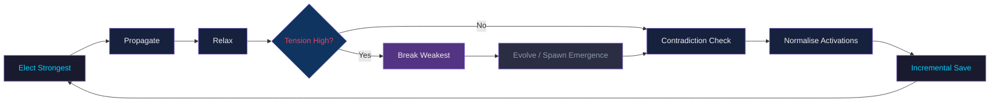

# BoggersTheAI

**Status: Living OS v0.3.0**

BoggersTheAI is a **local-first TS-OS (Thinking System Operating System)** runtime: a **living graph** (nodes, edges, activation, stability) plus **wave propagation** (elect → propagate → relax → prune → tension → emergence), **query processing** (retrieval, optional tools/adapters, synthesis), and optional **autonomy** (background OS loop), **self-improvement** (traces → dataset → QLoRA fine-tune → hot-swap), and **observability** (CLI, Rich TUI, FastAPI dashboard).

It favors **constraints, structure, and emergence** over scaling a single monolithic model. See [boggersthefish.com](https://www.boggersthefish.com/).

---

## Table of contents

1. [What you get](#what-you-get)
2. [Prerequisites](#prerequisites)
3. [Install](#install)
4. [First run](#first-run)
5. [Configuration](#configuration)
6. [CLI (`boggers`)](#cli-boggers)
7. [Python API](#python-api)
8. [Programmatic HTTP helper](#programmatic-http-helper)
9. [Web dashboard](#web-dashboard)
10. [Data files and directories](#data-files-and-directories)
11. [Architecture (short)](#architecture-short)
12. [Repository layout](#repository-layout)
13. [Testing](#testing)
14. [Contributing & license](#contributing--license)

---

## What you get

| Area | Capabilities |
|------|----------------|
| **Graph** | `UniversalLivingGraph`: nodes/edges with **embeddings**, topic index, hybrid topo+semantic wave, **SQLite** (default) or JSON persistence, thread-safe updates, **snapshot versioning + rollback**, **GraphML / JSON-LD export** |
| **Query pipeline** | Topic/context retrieval (including graph-aware subgraph), sufficiency scoring, optional Wikipedia/RSS/HN/Vault/Markdown/X ingestion, tools (search, calc, code run, file read), extractive or **Ollama** synthesis, **hypotheses + confidence + reasoning trace** |
| **Self-improvement** | High-confidence traces → Alpaca JSONL → `build_training_dataset` → optional **Unsloth QLoRA** `fine_tune_and_hotswap` / `trigger_self_improvement` with validation gating |
| **Autonomy** | Background **wave** thread with **damping, activation cap, guardrails** (max nodes, cycles/hr, tension pause); **OS loop** (exploration / consolidation / insight) when idle; **nightly consolidation**; **multi-turn** session memory; **cognitive temperament** presets |
| **Multimodal** | `ask_audio` / `ask_image` / `speak` — faster-whisper, piper, BLIP2-style captioning with graceful fallbacks if deps missing |
| **UX** | CLI commands, optional **Rich TUI** (`tui.enabled`), **FastAPI** dashboard (status, wave chart, graph JSON, **Cytoscape.js** viz, metrics, traces) |

---

## Prerequisites

- **Python 3.10+**
- **`config.yaml`** at the project root (or working directory when you run the app) — loaded automatically via `core/config_loader.py`.
- **Ollama** (recommended for real answers): install [Ollama](https://ollama.com/), then `ollama pull llama3.2` (or match `inference.ollama.model` in `config.yaml`).
- **Optional**
  - **GPU + VRAM** for Unsloth fine-tuning (`torch`, `unsloth` are in `pyproject.toml`).
  - **X API**: set `X_BEARER_TOKEN` (see `.env.example`) and enable `adapters.enabled.x_api` if you want live tweets.
  - **feedparser** etc. may be pulled as needed for RSS; network adapters use timeouts and log failures.

---

## Install

From the **`BoggersTheAI` directory** (the folder that contains `pyproject.toml`):

```bash
pip install -e .            # core only (pyyaml)
pip install -e ".[llm]"     # + ollama for LLM synthesis & embeddings
pip install -e ".[gpu]"     # + unsloth + torch for QLoRA fine-tuning
pip install -e ".[dev]"     # + pytest, black, ruff, mypy, fastapi, uvicorn
pip install -e ".[all]"     # everything
```

---

## First run

1. Copy `.env.example` → `.env` locally if you use tokens (never commit `.env`).
2. Ensure Ollama is running if `inference.ollama.enabled: true`.
3. Start chat:

```bash
boggers
```

4. Ask a question, or type `help` for built-in commands.

**Minimal Python check:**

```python
from BoggersTheAI import BoggersRuntime

rt = BoggersRuntime()
print(rt.get_status())
response = rt.ask("What is TS-OS in one sentence?")
print(response.answer)
rt.shutdown()
```

---

## Configuration

All behavior is driven by **`config.yaml`** in the working directory (merged over `RuntimeConfig` defaults).

| Section | What it controls |
|---------|-------------------|
| `modules` | Toggle core, adapters, tools, multimodal, consolidation/insight, interface |
| `inference` | Ollama model/temperature/tokens; self-improvement (traces, dataset build, fine-tuning, validation, safety) |
| `adapters.enabled` | Per-source: wikipedia, rss, hacker_news, vault, x_api |
| `tools` | Which tools are on; `code_run_timeout_seconds` |
| `multimodal` | Backends for voice in/out and image |
| `runtime` | `graph_path`, `graph_backend` (`json` / `sqlite`), `sqlite_path`, `insight_vault_path`, `session_id` (`auto` → persistent UUID in graph) |
| `wave` | Background wave interval, logging, `auto_save` |
| `os_loop` | Autonomy interval, idle threshold, `autonomous_modes`, `nightly_hour_utc`, `multi_turn_enabled` |
| `tui` | Rich TUI on/off and theme |
| `autonomous` | Exploration strength, consolidation prune threshold, insight tension floor |
| `deployment_tiers` | Preset hints (informational) |

**Environment variables** (see `.env.example`):

| Variable | Purpose |
|----------|---------|
| `X_BEARER_TOKEN` | X/Twitter API adapter |
| `BOGGERS_DASHBOARD_TOKEN` | If set, protects `/status`, `/graph`, `/metrics`, `/traces` with `Authorization: Bearer <token>` |
| `BOGGERS_DASHBOARD_HOST` | Dashboard bind host (default `0.0.0.0`) |
| `BOGGERS_DASHBOARD_PORT` | Dashboard port (default `8000`) |

---

## CLI (`boggers`)

Entry point: `boggers` → `BoggersTheAI.interface.chat:run_chat`.

| Command | Action |
|---------|--------|
| `help` / `/help` | List commands |
| `status` / `/status` | Wave engine status (cycles, nodes, edges, tension) |
| `graph` / `graph stats` | Graph metrics (nodes, edges, density, activation, topics) |
| `trace` / `trace show` | Print start of latest `traces/*.jsonl` |
| `wave pause` | Stop background wave thread |
| `wave resume` | Start background wave again |
| `improve` | Run `trigger_self_improvement()` |
| `history` | Recent conversation turn nodes |
| `exit` / `quit` | `shutdown()` and exit |

Any other line is sent to **`rt.ask(query)`** (natural-language query).

---

## Python API

Main type: **`BoggersRuntime`** (`from BoggersTheAI import BoggersRuntime, RuntimeConfig`).

| Method | Description |
|--------|-------------|
| `ask(query: str)` | Full query pipeline; uses multi-turn context when `os_loop.multi_turn_enabled` |
| `ask_audio(audio: bytes)` | Transcribe → ask |
| `ask_image(image: bytes, query_hint="")` | Caption → ask (optional) |
| `speak(text: str) -> bytes` | TTS bytes (piper or fallback) |
| `get_status() -> dict` | Wave / graph observability (delegates to graph) |
| `get_conversation_history(last_n=8) -> list[dict]` | Session turns from graph |
| `build_training_dataset() -> dict` | Scan traces → Alpaca `dataset/train.jsonl` & `val.jsonl` |
| `fine_tune_and_hotswap(epochs=1) -> dict` | Train + validate + hot-swap adapter (if enabled) |
| `trigger_self_improvement() -> dict` | Scheduled-style self-improvement check |
| `run_tui()` | Start Rich TUI if `tui.enabled` |
| `run_nightly_consolidation()` | Deep prune/merge/emergence (also tied to nightly window + shutdown) |
| `shutdown()` | Stop threads, save graph, cleanup |

**Response object** (`QueryResponse`): includes `answer`, `topics`, `sufficiency_score`, `used_research`, `used_tool`, `hypotheses`, `confidence`, `reasoning_trace`, `context_nodes` / `activation_scores` (for debugging), consolidation/insight fields as applicable.

---

## Programmatic HTTP helper

`BoggersTheAI.interface.api.handle_query` is a **library helper** (not a standalone server):

```python
from BoggersTheAI.interface.api import handle_query

result = handle_query({"query": "Explain wave propagation"})
# result: ok, answer, hypotheses, confidence, ...
```

Use FastAPI/Starlette yourself if you need a public HTTP API; the **dashboard** app is separate (see below).

---

## Web dashboard

```bash
dashboard-start
```

Defaults: host `0.0.0.0`, port `8000` (override with env vars above).

| Path | Auth | Description |
|------|------|-------------|
| `GET /status` | Bearer if `BOGGERS_DASHBOARD_TOKEN` set | JSON: wave status + graph counts |
| `GET /wave` | Public | HTML + Chart.js live tension chart (polls `/status`) |
| `GET /graph` | Bearer | Nodes + edges JSON |
| `GET /graph/viz` | Public | Sigma.js graph visualization (loads `/graph` in browser — **if token is set, open `/graph` in a tab with auth or unset token for local dev**) |
| `GET /metrics` | Bearer | Graph metrics + wave + stability trend |
| `GET /traces` | Bearer | Recent trace files |

**Note:** If `BOGGERS_DASHBOARD_TOKEN` is set, browser calls to `/status` and `/graph` must include the `Authorization` header; the bundled `/wave` and `/graph/viz` pages use simple `fetch` without headers, so **for local monitoring** either leave the token unset or use API clients (curl, scripts) with `Authorization: Bearer …`.

---

## Data files and directories

| Path | Purpose |
|------|---------|
| `graph.json` / `graph.db` | Default graph persistence (JSON or SQLite per `runtime.graph_backend`) |
| `traces/` | Reasoning traces (`*.jsonl`) for self-improvement |
| `dataset/` | Built train/val JSONL |
| `models/` | Fine-tuned adapters |
| `vault/` | Markdown insights from the insight engine |

These are listed in `.gitignore`; don’t commit private graphs or traces unless you intend to.

---

## Architecture (short)

- **Truth model:** stable **nodes** and **edges**; **activation** and **stability** change under wave rules.
- **Loop:** Propagate → Relax → (if tension high) Break → Evolve — implemented in `core/graph/rules_engine.py` and `core/wave.py`.
- **Query path:** extract topics → retrieve context (graph + adapters/tools) → synthesize (extractive or LLM) → optional consolidation/insight → trace logging when confidence is high.

### Wave cycle diagram



---

## Repository layout

```text
BoggersTheAI/
├── core/                   # Graph, wave, query processor, LLM, fine-tuner, traces, config, events, plugins, health, metrics
├── adapters/               # Wikipedia, RSS, Hacker News, Vault, Markdown, X
├── entities/               # Consolidation, insight, synthesis, inference router
├── tools/                  # Search, calc, code_run, file_read + router/executor
├── multimodal/             # Voice in/out, image captioning
├── interface/              # BoggersRuntime, CLI, api helper
├── mind/                   # Rich TUI
├── dashboard/              # FastAPI app
├── tests/                  # pytest suite
├── examples/               # quickstart.py, TS-OS_Living_Demo.ipynb, demos
├── config.yaml
└── pyproject.toml
```

---

## Testing

```bash
pytest -q
pytest --cov=BoggersTheAI -v
```

About **40** tests cover graph, wave, synthesis, router, runtime, consolidation, insight, adapters, tools, traces, fine-tuner, LLM, dashboard, and integration.

---

## Contributing & license

- **[CONTRIBUTING.md](CONTRIBUTING.md)** — setup, ruff/black/isort, PR notes.
- **License:** [MIT](LICENSE).
